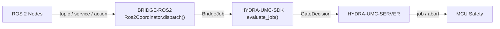

<!-- =============================================================================
HYDRA-UMC-BRIDGE-ROS2 - ROS 2 bidirectional coordination bridge
Copyright (C) 2026 JuanenRac (Electro Hobby 3D) <electrohobby3d@gmail.com>
GPL-3.0-or-later - see LICENSE
============================================================================= -->

<p align="center">
  
</p>

# 🤖 HYDRA-UMC-BRIDGE-ROS2

<p align="center">🇺🇸 <b>English</b> | <a href="README_spa.md">🇪🇸 Español</a> | <a href="README_fra.md">🇫🇷 Français</a> | <a href="README_ita.md">🇮🇹 Italiano</a> | <a href="README_deu.md">🇩🇪 Deutsch</a> | <a href="README_zho.md">🇨🇳 简体中文</a> | <a href="README_jpn.md">🇯🇵 日本語</a></p>

### 🔗 Dependency-Free Coordination Boundary Between HYDRA-UMC and ROS 2

<p align="left">
  
  
  
</p>

---

## 1. 🛠️ TECHNICAL OVERVIEW

**HYDRA-UMC-BRIDGE-ROS2** is the bidirectional, high-level coordination boundary between HYDRA-UMC and ROS 2. It maps continuous observation to a topic, immediate inspection to a service, and long-running cell work to a cancellable action. It is not a motor-control node, and it cannot bypass HYDRA-UMC-SERVER, MCU limits, watchdogs or E-STOP.

It belongs to the **External Automation Bridges** family: a set of sibling repositories (CNC, LASER, OPENPNP, PRINTER3D, ROS2) that all speak the same shared safety contract from `HYDRA-UMC-SDK`, so no bridge can invent its own definition of "safe to work".

### Key Features:
* ✅ **Real, dependency-free coordination core:** `coordinator.py`'s `Ros2Coordinator` has zero `rclpy` import — it is deliberately plain Python, testable on any host without a ROS 2 installation. *(implemented, tested in `tests/test_coordinator.py`)*
* ✅ **Real three-way interface mapping:** three fixed class attributes reserve the exact ROS 2 interface kind for each purpose — `/hydra_umc/machine_state` (topic, continuous state), `/hydra_umc/inspect_cell` (service, short inspection), `/hydra_umc/execute_cell_job` (action, cancellable job). *(implemented)*
* ✅ **Real shared safety gate:** every job dispatched through `Ros2Coordinator.dispatch()` is evaluated by `evaluate_job()` from `HYDRA-UMC-SDK`'s `bridge_contract`, the same gate every sibling bridge and HYDRA-UMC-SERVER use; a productive phase requires an `IDLE` external machine and a `READY` HYDRA-UMC cell, while `ABORT` remains requestable during a fault. *(implemented)*
* ✅ **Fail-closed phase routing and static evidence:** productive phases map only to the planned job action, `ABORT` maps to `/hydra_umc/request_safe_stop`, and an unknown future SDK phase is denied. `inspect_interface_plan.py` emits the static schema `1.1` plan — including the real `transient_local` durability QoS the state topic needs (ROS 2's own replacement for ROS 1's latched publisher, researched against design.ros2.org/articles/qos.html) — without importing `rclpy` or contacting DDS. *(implemented, tested)*
* ✅ **Real, partial `rclpy` transport:** `rclpy_transport.py` connects the 2 interfaces with a real, standard ROS 2 message type today — `Ros2SafeStopClient` (a real `std_srvs/Trigger` client) and `Ros2StateSubscriber` (a real `std_msgs/String` subscriber, using the real `transient_local` durability QoS). *(implemented, tested in `tests/test_rclpy_transport.py`)*
* ✅ **Non-mutating build/test:** `build-test.bat`/`.sh` compile the source and run deterministic unit tests without changing version or CHANGELOG. *(implemented, see BUILD & RUN below)*
* 🔜 **Custom `.srv`/`.action` contracts for `inspect_service`/`job_action`** — these have no real standard ROS 2 message type, so a client for them needs this repository to define its own interface package first. *(planned)*

---

## 2. 🔄 ROS 2 COORDINATION FLOW



---

## 3. 🧱 ARCHITECTURE & DESIGN DECISIONS

* **Why `coordinator.py` has zero `rclpy` dependency.** Its own module docstring states this deliberately: it "can be tested on any host and becomes a ROS 2 node only through a separately deployed adapter." This keeps the safety-relevant coordination logic testable in CI without a ROS 2 installation, and lets the adapter be chosen and validated independently, later.
* **Why three distinct interface kinds instead of one generic channel.** `state_topic`, `inspect_service` and `job_action` map to ROS 2's own semantics on purpose: continuous state publication doesn't need request/reply (topic), a quick inspection needs a synchronous answer (service), and cell work needs to be cancellable mid-flight (action) — collapsing these into one channel would lose that distinction.
* **Why `Ros2Coordinator.dispatch()` still funnels every job through the shared `evaluate_job()` gate.** ROS 2 is just another client of the same `bridge_contract` that CNC, LASER, OPENPNP and PRINTER3D use — it gets no special bypass of the IDLE/READY logic that every other bridge and HYDRA-UMC-SERVER enforce.
* **Why `ABORT` stays requestable during a fault.** The gate's productive-phase requirement (`IDLE` + `READY`) is intentionally not applied the same way to an abort request — an operator or a ROS 2 node must always be able to ask for a controlled stop, even mid-fault.
* **Why the `rclpy` adapter and ROS `.msg`/`.srv`/`.action` contracts are not in this repo yet.** Committing to specific message/service/action definitions before a real ROS 2 environment is selected and tested would risk baking in assumptions this local, dependency-free core cannot verify.
* **How this fits the rest of the ecosystem.** BRIDGE-ROS2 sits between ROS 2 nodes and `HYDRA-UMC-SDK` → `HYDRA-UMC-SERVER` → MCU safety — it is a coordination boundary, never a motor-control node, and it cannot bypass HYDRA-UMC-SERVER, MCU limits, watchdogs or E-STOP.

---

## 📂 DIRECTORY STRUCTURE

```text
HYDRA-UMC-BRIDGE-ROS2/
├── src/
│   └── hydra_umc_bridge_ros2/
│       ├── __init__.py
│       ├── coordinator.py       # Ros2Coordinator: dependency-free topic/service/action gate
│       ├── rclpy_transport.py   # Real rclpy transport - only the 2 interfaces with a real, standard ROS 2 message type
│       └── mqtt_transport.py    # Real MQTT broker transport for this bridge's own already-real logic
├── tests/
│   ├── test_coordinator.py      # Deterministic unit tests for the coordination core
│   ├── test_rclpy_transport.py  # Real rclpy transport tests against a fake node/publisher
│   ├── test_mqtt_transport.py   # MQTT command/status shape tests against a fake broker client
│   └── fixtures/
│       ├── interface-plan-v1.json    # Schema-1.0 interface compatibility fixture
│       └── interface-plan-v1.1.json  # Published schema-1.1 interface compatibility fixture
├── tools/
│   ├── build_test.py            # Non-mutating compile + test runner (build-test.bat/.sh)
│   ├── inspect_interface_plan.py # Emits the static, plan-only schema-1.1 interface JSON
│   ├── ci_validate.py           # Dependency-free, non-destructive CI baseline (used by .github/workflows/ci.yml)
│   └── bump_version.py          # Synchronizes pyproject.toml, manifest and CHANGELOG.md
├── docs/
│   └── BRIDGE_GUIDE.md          # Scope, compatible platforms, scripts, hardware acceptance gate
├── images/
│   └── HYDRA_UMC_BANNER.svg     # README banner
├── build-test.bat / build-test.sh  # Validate only, never modifies the repository
├── build.bat / build.sh            # Validate, then bump version + CHANGELOG on success
├── pyproject.toml               # Package metadata; depends on HYDRA-UMC-SDK (git)
├── hydra-umc.project.json       # Ecosystem manifest (version, maturity, family)
├── CHANGELOG.md
├── CODE_OF_CONDUCT.md / CONTRIBUTING.md / SECURITY.md / SUPPORT.md
├── LICENSE / LICENSE.md
└── README.md / README_*.md      # This file and its 6 translations
```

---

## 4. ⚙️ BUILD & RUN

Requires Python 3.11+. `tools/build_test.py` expects `HYDRA-UMC-SDK` checked out as a sibling directory (`../HYDRA-UMC-SDK`) or pointed at via the `HYDRA_UMC_SDK_ROOT` environment variable.

```bash
# Windows
build-test.bat      # validate only — no version/CHANGELOG change
build.bat            # validate, then bump version + CHANGELOG on success

# Linux/macOS
bash build-test.sh
bash build.sh
```

`build-test` compiles every module under `src/` with `py_compile` and runs the full `unittest` suite (`tests/test_coordinator.py`) — deterministically, with no ROS 2 install, no network and no version/CHANGELOG change. `build` runs that same validation first and, only on success, calls `tools/bump_version.py` to synchronize the version across `pyproject.toml`, `hydra-umc.project.json` and `CHANGELOG.md`. There is no live hardware `run` command yet — that requires a validated ROS 2 deployment.

---

## ✅ Current Status & Next Steps

**Real today:** version `0.0.5`, functional as a dependency-free coordination core (`Ros2Coordinator`) with a deterministic twenty-one-test `unittest` suite covering the coordination core, the MQTT transport and the rclpy transport, fail-closed phase routing, a static `plan-only` interface schema declaring the real `transient_local` durability QoS the state topic needs, a real (lazily-imported) rclpy transport for the 2 interfaces with a real standard ROS 2 message type, and non-mutating build-test scripts wired into CI with an SDK checkout.

**Integration boundary:** this bridge is a coordination boundary only — it is not a motor-control node, and it cannot bypass HYDRA-UMC-SERVER, MCU limits, watchdogs or E-STOP; every dispatched job still passes through the same shared gate every sibling bridge uses.

**Still ahead:** no ROS network, robot or physical actuator has been validated yet — the `rclpy` adapter and concrete ROS `.msg`/`.srv`/`.action` contracts will be introduced only after a real ROS 2 environment is selected and tested.

---

## 🔗 Related Projects

This project is part of the HYDRA-UMC robotics ecosystem by the same author (JuanenRac / Electro Hobby 3D). Worth knowing about, since a request might actually be about one of these rather than this repository.

**Parent Project**
- **[HYDRA-UMC-SERVER](https://github.com/JuanenRac/HYDRA-UMC-SERVER)** — the real headless backend (REST/WebSocket) every control client actually talks to; the authenticated ecosystem boundary this bridge reports to once each command has cleared this bridge's own local safety gate.

**Sibling Projects** — also talk to HYDRA-UMC-SERVER's own API, each their own client
- **[HYDRA-UMC-STUDIO](https://github.com/JuanenRac/HYDRA-UMC-STUDIO)** — web control dashboard with real-time multi-robot 3D visualization.
- **[HYDRA-UMC-SUITE](https://github.com/JuanenRac/HYDRA-UMC-SUITE)** — desktop (PySide6) swarm command center for multiple servers at once, packaged as a standalone executable.
- **[HYDRA-UMC-ANDROID-CONTROL](https://github.com/JuanenRac/HYDRA-UMC-ANDROID-CONTROL)** — native Android control app with biometric login and a paired Wear OS companion.
- **[HYDRA-UMC-IOS-CONTROL](https://github.com/JuanenRac/HYDRA-UMC-IOS-CONTROL)** — iOS/iPadOS control app (Flutter) with real-time WebSocket sync.
- **[HYDRA-UMC-DSI](https://github.com/JuanenRac/HYDRA-UMC-DSI)** — native touch UI for the onboard 7" DSI touchscreen, embedded on the CM5 itself.
- **[HYDRA-UMC-BRIDGE-AMR](https://github.com/JuanenRac/HYDRA-UMC-BRIDGE-AMR)** — coordination boundary for AGV/AMR fleets via a real VDA 5050 MQTT publisher.
- **[HYDRA-UMC-BRIDGE-CNC](https://github.com/JuanenRac/HYDRA-UMC-BRIDGE-CNC)** — high-level CNC-cell coordinator with real GRBL status/control-byte access.
- **[HYDRA-UMC-BRIDGE-DROIDS](https://github.com/JuanenRac/HYDRA-UMC-BRIDGE-DROIDS)** — coordination boundary for legged/humanoid droids, with a real Boston Dynamics Spot command sender.
- **[HYDRA-UMC-BRIDGE-LASER](https://github.com/JuanenRac/HYDRA-UMC-BRIDGE-LASER)** — laser-cell safety coordinator reading 3 real key/enclosure/interlock GPIO safeguards.
- **[HYDRA-UMC-BRIDGE-OPENPNP](https://github.com/JuanenRac/HYDRA-UMC-BRIDGE-OPENPNP)** — safe high-level board-flow coordinator for OpenPnP pick-and-place.
- **[HYDRA-UMC-BRIDGE-PRINTER3D](https://github.com/JuanenRac/HYDRA-UMC-BRIDGE-PRINTER3D)** — safe coordination boundary for Moonraker/Klipper 3D printers, with real gated job commands.
- **[HYDRA-UMC-BRIDGE-UAV](https://github.com/JuanenRac/HYDRA-UMC-BRIDGE-UAV)** — coordination boundary for camera-equipped UAVs, with a real MAVLink command sender.

**Directly Related**
- **[HYDRA-UMC-SDK](https://github.com/JuanenRac/HYDRA-UMC-SDK)** — the shared JSON-Schema contract and safety-gate boundary every bridge validates its commands against.
- **[HYDRA-UMC-MQTT-BROKER](https://github.com/JuanenRac/HYDRA-UMC-MQTT-BROKER)** — `mqtt_transport.py`'s real transport for this bridge's own `hydra/bridges/ros2/...` topics — the plan-only job gate, a real `std_srvs/Trigger` safe-stop call, and the real ROS 2 state topic republished as the separately-deployed `rclpy_transport.py` adapter always anticipated; see that repo's own `docs/BRIDGE_TOPICS.md`.
- **[HYDRA-UMC-HIL-BRIDGE](https://github.com/JuanenRac/HYDRA-UMC-HIL-BRIDGE)** — hardware-in-the-loop evidence path for a real ROS 2 deployment.

**Also Part of the Ecosystem**

*Core Hardware & Platform*
- **[HYDRA-UMC](https://github.com/JuanenRac/HYDRA-UMC)** — the physical robot-arm motherboard: CM5 host + dual-core STM32H745, orchestrating up to 8 tool arms over CAN-OTA/SPI-OTA.
- **[HYDRA-UMC-OS](https://github.com/JuanenRac/HYDRA-UMC-OS)** — reproducible Raspberry Pi OS product layer for the CM5: read-only agent, validated config/profiles, WiFi first-contact provisioning.

*Core Backend & Clients*
- **[HYDRA-UMC-EDITOR-URDF](https://github.com/JuanenRac/HYDRA-UMC-EDITOR-URDF)** — desktop graphical URDF creator/editor that pushes finished models into STUDIO's own catalog.

*URTC Tool Platform*
- **[URTC](https://github.com/JuanenRac/URTC)** — firmware for the physical Universal Robot Tool Controller PCB, 25+ tool profiles over CAN bus.
- **[URTC-FLASHER](https://github.com/JuanenRac/URTC-FLASHER)** — desktop GUI flashing tool for URTC boards, CAN-OTA plus full-chip SWD/JTAG.
- **[URTC-TESTER](https://github.com/JuanenRac/URTC-TESTER)** — desktop live CAN-bus diagnostic tool for URTC boards, one panel per tool profile.
- **[URTC-WEB-STUDIO](https://github.com/JuanenRac/URTC-WEB-STUDIO)** — browser-based alternative to URTC-TESTER via the Web Serial API, no local install needed.

*Vision AI Node (Hailo-8)*
- **[HYDRA-UMC-VISION-NODE](https://github.com/JuanenRac/HYDRA-UMC-VISION-NODE)** — integration hub for the Hailo-8 vision pipeline, with a real per-stage hardware-readiness check.
- **[HYDRA-UMC-DETECTION-HEF](https://github.com/JuanenRac/HYDRA-UMC-DETECTION-HEF)** — real compiled-model registry with Hailo-architecture/checksum safe-load verification.
- **[HYDRA-UMC-VISION-STREAMER](https://github.com/JuanenRac/HYDRA-UMC-VISION-STREAMER)** — real GStreamer pipeline + MediaMTX config generator with a real HailoRT integration boundary.
- **[HYDRA-UMC-VISUAL-SERVOING-API](https://github.com/JuanenRac/HYDRA-UMC-VISUAL-SERVOING-API)** — real Position-Based Visual Servoing correction law, safety-gated on upstream zone state.
- **[HYDRA-UMC-SAFETY-ZONES](https://github.com/JuanenRac/HYDRA-UMC-SAFETY-ZONES)** — real zone-breach checking and E-STOP requesting, with calibration-freshness enforcement.

*Cognitive AI Node (Hailo-10)*
- **[HYDRA-UMC-COGNITIVE-NODE](https://github.com/JuanenRac/HYDRA-UMC-COGNITIVE-NODE)** — integration hub for the Hailo-10 cognitive pipeline (LLM/VLA/voice orchestration).
- **[HYDRA-UMC-VLA-ENGINE](https://github.com/JuanenRac/HYDRA-UMC-VLA-ENGINE)** — real action-token encoding/decoding and trajectory generation for a Vision-Language-Action model.
- **[HYDRA-UMC-VOICE-UI](https://github.com/JuanenRac/HYDRA-UMC-VOICE-UI)** — real voice front-end (VAD + intent parser) with a bounded, confirmation-gated Watch relay.
- **[HYDRA-UMC-SEMANTIC-PLANNER](https://github.com/JuanenRac/HYDRA-UMC-SEMANTIC-PLANNER)** — real rule-based task decomposition and semantic error recovery over MCU error codes.
- **[HYDRA-UMC-DOCS-QA](https://github.com/JuanenRac/HYDRA-UMC-DOCS-QA)** — real stdlib-only TF-IDF document search over this ecosystem's own Markdown docs.

*Orchestration & Swarm*
- **[HYDRA-UMC-ORCHESTRATOR](https://github.com/JuanenRac/HYDRA-UMC-ORCHESTRATOR)** — integration hub with a real gRPC/Protobuf health-report contract and mission state machine.
- **[HYDRA-UMC-JOB-DISPATCHER](https://github.com/JuanenRac/HYDRA-UMC-JOB-DISPATCHER)** — real priority-based job queue with deduplication, over a real HTTP API.
- **[HYDRA-UMC-NODE-HEALING](https://github.com/JuanenRac/HYDRA-UMC-NODE-HEALING)** — real gRPC-based fleet health watchdog with retry/backoff and identity-mismatch detection.
- **[HYDRA-UMC-PATH-PLANNER-3D](https://github.com/JuanenRac/HYDRA-UMC-PATH-PLANNER-3D)** — real RRT-based 3D path planner with real obstacle/workspace collision validation.
- **[HYDRA-UMC-SWARM-SYNC](https://github.com/JuanenRac/HYDRA-UMC-SWARM-SYNC)** — real CRDT LWW-Element-Map state sync, property-tested for multi-cell convergence.

*Digital Twin & Simulation*
- **[HYDRA-UMC-TWIN](https://github.com/JuanenRac/HYDRA-UMC-TWIN)** — integration hub for the digital-twin engine, with a real version-compatibility sync contract.
- **[HYDRA-UMC-PHYSICS-REPLICA](https://github.com/JuanenRac/HYDRA-UMC-PHYSICS-REPLICA)** — real forward kinematics and joint-limit validation over a real URDF subset.
- **[HYDRA-UMC-SYNTHETIC-DATA-GEN](https://github.com/JuanenRac/HYDRA-UMC-SYNTHETIC-DATA-GEN)** — real procedural 2D scene generator with YOLO/COCO annotation export.

*Data & Analytics*
- **[HYDRA-UMC-DATALAKE](https://github.com/JuanenRac/HYDRA-UMC-DATALAKE)** — real sqlite3-backed time-series store with a real ingest/query HTTP API.
- **[HYDRA-UMC-ANOMALY-DETECTOR](https://github.com/JuanenRac/HYDRA-UMC-ANOMALY-DETECTOR)** — real FFT + statistical baseline anomaly detector with drift monitoring.
- **[HYDRA-UMC-PRODUCTION-REPORTS](https://github.com/JuanenRac/HYDRA-UMC-PRODUCTION-REPORTS)** — real OEE/availability calculation over DATALAKE history, with reproducible CSV export.
- **[HYDRA-UMC-TELEMETRY-COLLECTOR](https://github.com/JuanenRac/HYDRA-UMC-TELEMETRY-COLLECTOR)** — real CAN/WebSocket ingestion pipeline into DATALAKE, with sequence deduplication.

*Industrial Gateway*
- **[HYDRA-UMC-GATEWAY-INDUSTRIAL](https://github.com/JuanenRac/HYDRA-UMC-GATEWAY-INDUSTRIAL)** — integration hub relaying to industrial protocols, with a real command allowlist/backpressure layer.
- **[HYDRA-UMC-OPCUA-SERVER](https://github.com/JuanenRac/HYDRA-UMC-OPCUA-SERVER)** — real OPC-UA address space, verified with a real binary-protocol client session.
- **[HYDRA-UMC-MTCONNECT-ADAPTER](https://github.com/JuanenRac/HYDRA-UMC-MTCONNECT-ADAPTER)** — real MTConnect `/probe` and `/current` XML endpoints with degraded-mode output.

*Complementary Tools & Ecosystem Operations*
- **[HYDRA-UMC-DASHBOARD-AI](https://github.com/JuanenRac/HYDRA-UMC-DASHBOARD-AI)** — Smart Summaries and Anomaly Highlighting panels over DATALAKE/ANOMALY-DETECTOR, with an honest statistical fallback.
- **[HYDRA-UMC-TOOL-CLI](https://github.com/JuanenRac/HYDRA-UMC-TOOL-CLI)** — fleet CLI with a real, stable exit-code contract, a genuine live client of HYDRA-UMC-SERVER's own API.
- **[HYDRA-UMC-WATCH](https://github.com/JuanenRac/HYDRA-UMC-WATCH)** — WearOS companion app with real haptic alerts and a paired-phone voice relay.
- **[URTC-SMART-RACK](https://github.com/JuanenRac/URTC-SMART-RACK)** — firmware for a board-mounting rack with real tool-ID decoding and Smart Idle pre-heating logic.
- **[URTC-VISION-TOOL](https://github.com/JuanenRac/URTC-VISION-TOOL)** — firmware plus a real Python vision companion for a thermal/RGB inspection tool head.
- **[HYDRA-UMC-UPDATER](https://github.com/JuanenRac/HYDRA-UMC-UPDATER)** — administrative desktop tool that discovers, clones and updates every repo in this ecosystem.

## 👤 AUTHOR
**JuanenRac** (Electro Hobby 3D)
📧 electrohobby3d@gmail.com
📺 [youtube.com/@electrohobby3d](https://youtube.com/@electrohobby3d)

## 📜 LICENSE
GPL-3.0 - See LICENSE for details.
