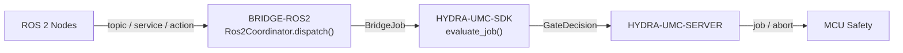

<!-- =============================================================================
HYDRA-UMC-BRIDGE-ROS2 - ROS 2 bidirectional coordination bridge
Copyright (C) 2026 JuanenRac (Electro Hobby 3D) <electrohobby3d@gmail.com>
GPL-3.0-or-later - see LICENSE
============================================================================= -->

<p align="center">
  
</p>

# 🤖 HYDRA-UMC-BRIDGE-ROS2

<p align="center">🇺🇸 <b>English</b> | <a href="README_spa.md">🇪🇸 Español</a> | <a href="README_fra.md">🇫🇷 Français</a> | <a href="README_ita.md">🇮🇹 Italiano</a> | <a href="README_deu.md">🇩🇪 Deutsch</a> | <a href="README_zho.md">🇨🇳 简体中文</a> | <a href="README_jpn.md">🇯🇵 日本語</a></p>

### 🔗 Dependency-Free Coordination Boundary Between HYDRA-UMC and ROS 2

<p align="left">
  
  
  
</p>

---

## 1. 🛠️ TECHNICAL OVERVIEW

**HYDRA-UMC-BRIDGE-ROS2** is the bidirectional, high-level coordination boundary between HYDRA-UMC and ROS 2. It maps continuous observation to a topic, immediate inspection to a service, and long-running cell work to a cancellable action. It is not a motor-control node, and it cannot bypass HYDRA-UMC-SERVER, MCU limits, watchdogs or E-STOP.

It belongs to the **External Automation Bridges** family: a set of sibling repositories (CNC, LASER, OPENPNP, PRINTER3D, ROS2) that all speak the same shared safety contract from `HYDRA-UMC-SDK`, so no bridge can invent its own definition of "safe to work".

### Key Features:
* ✅ **Real, dependency-free coordination core:** `coordinator.py`'s `Ros2Coordinator` has zero `rclpy` import — it is deliberately plain Python, testable on any host without a ROS 2 installation. *(implemented, tested in `tests/test_coordinator.py`)*
* ✅ **Real three-way interface mapping:** three fixed class attributes reserve the exact ROS 2 interface kind for each purpose — `/hydra_umc/machine_state` (topic, continuous state), `/hydra_umc/inspect_cell` (service, short inspection), `/hydra_umc/execute_cell_job` (action, cancellable job). *(implemented)*
* ✅ **Real shared safety gate:** every job dispatched through `Ros2Coordinator.dispatch()` is evaluated by `evaluate_job()` from `HYDRA-UMC-SDK`'s `bridge_contract`, the same gate every sibling bridge and HYDRA-UMC-SERVER use; a productive phase requires an `IDLE` external machine and a `READY` HYDRA-UMC cell, while `ABORT` remains requestable during a fault. *(implemented)*
* ✅ **Fail-closed phase routing and static evidence:** productive phases map only to the planned job action, `ABORT` maps to `/hydra_umc/request_safe_stop`, and an unknown future SDK phase is denied. `inspect_interface_plan.py` emits the static schema `1.0` plan without importing `rclpy` or contacting DDS. *(implemented, tested)*
* ✅ **Non-mutating build/test:** `build-test.bat`/`.sh` compile the source and run deterministic unit tests without changing version or CHANGELOG. *(implemented, see BUILD & RUN below)*
* 🔜 **`rclpy` adapter and ROS `.msg`/`.srv`/`.action` contracts** — introduced only after a real ROS 2 environment is selected and tested. *(planned)*

---

## 2. 🔄 ROS 2 COORDINATION FLOW



---

## 3. 🧱 ARCHITECTURE & DESIGN DECISIONS

* **Why `coordinator.py` has zero `rclpy` dependency.** Its own module docstring states this deliberately: it "can be tested on any host and becomes a ROS 2 node only through a separately deployed adapter." This keeps the safety-relevant coordination logic testable in CI without a ROS 2 installation, and lets the adapter be chosen and validated independently, later.
* **Why three distinct interface kinds instead of one generic channel.** `state_topic`, `inspect_service` and `job_action` map to ROS 2's own semantics on purpose: continuous state publication doesn't need request/reply (topic), a quick inspection needs a synchronous answer (service), and cell work needs to be cancellable mid-flight (action) — collapsing these into one channel would lose that distinction.
* **Why `Ros2Coordinator.dispatch()` still funnels every job through the shared `evaluate_job()` gate.** ROS 2 is just another client of the same `bridge_contract` that CNC, LASER, OPENPNP and PRINTER3D use — it gets no special bypass of the IDLE/READY logic that every other bridge and HYDRA-UMC-SERVER enforce.
* **Why `ABORT` stays requestable during a fault.** The gate's productive-phase requirement (`IDLE` + `READY`) is intentionally not applied the same way to an abort request — an operator or a ROS 2 node must always be able to ask for a controlled stop, even mid-fault.
* **Why the `rclpy` adapter and ROS `.msg`/`.srv`/`.action` contracts are not in this repo yet.** Committing to specific message/service/action definitions before a real ROS 2 environment is selected and tested would risk baking in assumptions this local, dependency-free core cannot verify.
* **How this fits the rest of the ecosystem.** BRIDGE-ROS2 sits between ROS 2 nodes and `HYDRA-UMC-SDK` → `HYDRA-UMC-SERVER` → MCU safety — it is a coordination boundary, never a motor-control node, and it cannot bypass HYDRA-UMC-SERVER, MCU limits, watchdogs or E-STOP.

---

## 📂 DIRECTORY STRUCTURE

```text
HYDRA-UMC-BRIDGE-ROS2/
├── src/
│   └── hydra_umc_bridge_ros2/
│       ├── __init__.py
│       └── coordinator.py       # Ros2Coordinator: dependency-free topic/service/action gate
├── tests/
│   ├── test_coordinator.py      # Deterministic unit tests for the coordination core
│   └── fixtures/interface-plan-v1.json # Published schema-1.0 interface compatibility fixture
├── tools/
│   ├── build_test.py            # Non-mutating compile + test runner (build-test.bat/.sh)
│   └── bump_version.py          # Synchronizes pyproject.toml, manifest and CHANGELOG.md
├── build-test.bat / build-test.sh  # Validate only, never modifies the repository
├── build.bat / build.sh            # Validate, then bump version + CHANGELOG on success
├── pyproject.toml               # Package metadata; depends on HYDRA-UMC-SDK (git)
├── hydra-umc.project.json       # Ecosystem manifest (version, maturity, family)
├── CHANGELOG.md
├── CODE_OF_CONDUCT.md / CONTRIBUTING.md / SECURITY.md / SUPPORT.md
├── LICENSE / LICENSE.md
└── README.md / README_*.md      # This file and its 6 translations
```

---

## 4. ⚙️ BUILD & RUN

Requires Python 3.11+. `tools/build_test.py` expects `HYDRA-UMC-SDK` checked out as a sibling directory (`../HYDRA-UMC-SDK`) or pointed at via the `HYDRA_UMC_SDK_ROOT` environment variable.

```bash
# Windows
build-test.bat      # validate only — no version/CHANGELOG change
build.bat            # validate, then bump version + CHANGELOG on success

# Linux/macOS
bash build-test.sh
bash build.sh
```

`build-test` compiles every module under `src/` with `py_compile` and runs the full `unittest` suite (`tests/test_coordinator.py`) — deterministically, with no ROS 2 install, no network and no version/CHANGELOG change. `build` runs that same validation first and, only on success, calls `tools/bump_version.py` to synchronize the version across `pyproject.toml`, `hydra-umc.project.json` and `CHANGELOG.md`. There is no live hardware `run` command yet — that requires a validated ROS 2 deployment.

---

## ✅ Current Status & Next Steps

**Real today:** version `0.0.2`, functional as a dependency-free coordination core (`Ros2Coordinator`) with five deterministic local safety tests, fail-closed phase routing, a static `plan-only` interface schema, and non-mutating build-test scripts wired into CI with an SDK checkout.

**Integration boundary:** this bridge is a coordination boundary only — it is not a motor-control node, and it cannot bypass HYDRA-UMC-SERVER, MCU limits, watchdogs or E-STOP; every dispatched job still passes through the same shared gate every sibling bridge uses.

**Still ahead:** no ROS network, robot or physical actuator has been validated yet — the `rclpy` adapter and concrete ROS `.msg`/`.srv`/`.action` contracts will be introduced only after a real ROS 2 environment is selected and tested.

---

## 🔗 Related Projects

This project is part of a larger robotics ecosystem by the same author (JuanenRac / Electro Hobby 3D), spanning firmware, control software, AI nodes and fleet tooling. Worth knowing about, since a request might actually be about one of these rather than this repository.

### Directly Related

- **[HYDRA-UMC-SDK](https://github.com/JuanenRac/HYDRA-UMC-SDK)** — the shared job-and-safety contract every bridge (including this one) evaluates jobs through.
- **[HYDRA-UMC-SERVER](https://github.com/JuanenRac/HYDRA-UMC-SERVER)** — the authenticated ecosystem boundary this bridge reports to.
- **[HYDRA-UMC-HIL-BRIDGE](https://github.com/JuanenRac/HYDRA-UMC-HIL-BRIDGE)** — hardware-in-the-loop evidence path for a real ROS 2 deployment.

### Rest of the Ecosystem

**HYDRA-UMC platform** — the multi-robot micro-factory cell this bridge coordinates auxiliaries for
- **[HYDRA-UMC](https://github.com/JuanenRac/HYDRA-UMC)** — the CM5 + STM32H745 motherboard orchestrating up to 8 robot arms.
- **[HYDRA-UMC-SERVER](https://github.com/JuanenRac/HYDRA-UMC-SERVER)** — the Express/WebSocket backend every control client and bridge talks to.
- **[HYDRA-UMC-STUDIO](https://github.com/JuanenRac/HYDRA-UMC-STUDIO)** — web-based control dashboard, multi-robot 3D visualization.

**External Automation Bridges** — sibling repos sharing this same `HYDRA-UMC-SDK` job gate
- **[HYDRA-UMC-BRIDGE-CNC](https://github.com/JuanenRac/HYDRA-UMC-BRIDGE-CNC)** — CNC cell coordination bridge.
- **[HYDRA-UMC-BRIDGE-LASER](https://github.com/JuanenRac/HYDRA-UMC-BRIDGE-LASER)** — laser-cell coordination bridge.
- **[HYDRA-UMC-BRIDGE-OPENPNP](https://github.com/JuanenRac/HYDRA-UMC-BRIDGE-OPENPNP)** — board-flow bridge for OpenPnP.
- **[HYDRA-UMC-BRIDGE-PRINTER3D](https://github.com/JuanenRac/HYDRA-UMC-BRIDGE-PRINTER3D)** — coordination bridge for open 3D-printing software.

**Safety & Integration Evidence**
- **[HYDRA-UMC-SAFETY-ZONES](https://github.com/JuanenRac/HYDRA-UMC-SAFETY-ZONES)** — cell-zone safety evidence used across the bridge family.
- **[HYDRA-UMC-HIL-BRIDGE](https://github.com/JuanenRac/HYDRA-UMC-HIL-BRIDGE)** — hardware-in-the-loop test evidence.

## 👤 AUTHOR
**JuanenRac** (Electro Hobby 3D)
📧 electrohobby3d@gmail.com

## 📜 LICENSE
GPL-3.0 - See LICENSE for details.
