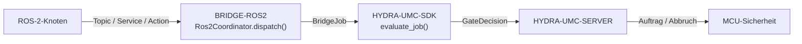

<!-- =============================================================================
HYDRA-UMC-BRIDGE-ROS2 - Bidirektionale Koordinationsbrücke zu ROS 2
Copyright (C) 2026 JuanenRac (Electro Hobby 3D) <electrohobby3d@gmail.com>
GPL-3.0-or-later - see LICENSE
============================================================================= -->

<p align="center">
  
</p>

# 🤖 HYDRA-UMC-BRIDGE-ROS2

<p align="center"><a href="README.md">🇺🇸 English</a> | <a href="README_spa.md">🇪🇸 Español</a> | <a href="README_fra.md">🇫🇷 Français</a> | <a href="README_ita.md">🇮🇹 Italiano</a> | 🇩🇪 <b>Deutsch</b> | <a href="README_zho.md">🇨🇳 简体中文</a> | <a href="README_jpn.md">🇯🇵 日本語</a></p>

### 🔗 Abhängigkeitsfreie Koordinationsgrenze zwischen HYDRA-UMC und ROS 2

<p align="left">
  
  
  
</p>

---

## 1. 🛠️ TECHNISCHER ÜBERBLICK

**HYDRA-UMC-BRIDGE-ROS2** ist die bidirektionale, High-Level-Koordinationsgrenze zwischen HYDRA-UMC und ROS 2. Sie bildet kontinuierliche Beobachtung auf ein Topic, sofortige Inspektion auf einen Service und lang laufende Zellenarbeit auf eine abbrechbare Action ab. Sie ist kein Motorsteuerungsknoten und kann HYDRA-UMC-SERVER, MCU-Grenzen, Watchdogs oder den E-STOP nicht umgehen.

Sie gehört zur Familie **External Automation Bridges**: einer Gruppe von Schwester-Repositories (CNC, LASER, OPENPNP, PRINTER3D, ROS2), die alle denselben gemeinsamen Sicherheitsvertrag von `HYDRA-UMC-SDK` sprechen, sodass keine Brücke ihre eigene Definition von "sicher zum Arbeiten" erfinden kann.

### Kernfunktionen:
* ✅ **Echter, abhängigkeitsfreier Koordinationskern:** `coordinator.py`s `Ros2Coordinator` hat keinerlei `rclpy`-Import — es ist bewusst reines Python, testbar auf jedem Host ohne ROS-2-Installation. *(implementiert, getestet in `tests/test_coordinator.py`)*
* ✅ **Echte Drei-Wege-Schnittstellenabbildung:** drei feste Klassenattribute reservieren für jeden Zweck genau die richtige ROS-2-Schnittstellenart — `/hydra_umc/machine_state` (Topic, kontinuierlicher Zustand), `/hydra_umc/inspect_cell` (Service, kurze Inspektion), `/hydra_umc/execute_cell_job` (Action, abbrechbarer Auftrag). *(implementiert)*
* ✅ **Echtes gemeinsames Sicherheitsgatter:** jeder über `Ros2Coordinator.dispatch()` versendete Auftrag wird durch `evaluate_job()` aus dem `bridge_contract` von `HYDRA-UMC-SDK` bewertet — demselben Gatter, das jede Schwesterbrücke und HYDRA-UMC-SERVER verwenden; eine produktive Phase erfordert eine externe Maschine im Zustand `IDLE` und eine `READY`-HYDRA-UMC-Zelle, während `ABORT` auch während eines Fehlers angefordert werden kann. *(implementiert)*
* ✅ **Ausfallsicheres Phasenrouting und statische Evidenz:** produktive Phasen werden nur der geplanten Arbeitsaktion zugeordnet, `ABORT` wird `/hydra_umc/request_safe_stop` zugeordnet und eine unbekannte zukünftige SDK-Phase wird abgelehnt. `inspect_interface_plan.py` gibt den statischen Schema-`1.0`-Plan aus, ohne `rclpy` zu importieren oder DDS zu kontaktieren. *(implementiert, getestet)*
* ✅ **Nicht-mutierender Build/Test:** `build-test.bat`/`.sh` kompilieren den Quellcode und führen deterministische Unit-Tests aus, ohne Version oder CHANGELOG zu ändern. *(implementiert, siehe BUILD & AUSFÜHRUNG unten)*
* 🔜 **`rclpy`-Adapter und ROS-`.msg`/`.srv`/`.action`-Verträge** — werden erst eingeführt, nachdem eine echte ROS-2-Umgebung ausgewählt und getestet wurde. *(geplant)*

---

## 2. 🔄 ROS-2-KOORDINATIONSABLAUF



---

## 3. 🧱 ARCHITEKTUR UND DESIGN-ENTSCHEIDUNGEN

* **Warum `coordinator.py` keinerlei `rclpy`-Abhängigkeit hat.** Der eigene Modul-Docstring stellt dies bewusst fest: er "kann auf jedem Host getestet werden und wird nur über einen separat bereitgestellten Adapter zu einem ROS-2-Knoten." Das hält die sicherheitsrelevante Koordinationslogik in CI testbar, ohne ROS-2-Installation, und erlaubt es, den Adapter später unabhängig auszuwählen und zu validieren.
* **Warum drei verschiedene Schnittstellenarten statt eines generischen Kanals.** `state_topic`, `inspect_service` und `job_action` entsprechen absichtlich der eigenen Semantik von ROS 2: kontinuierliche Zustandsveröffentlichung braucht keine Anfrage/Antwort (Topic), eine schnelle Inspektion braucht eine synchrone Antwort (Service), und Zellenarbeit muss mitten im Ablauf abbrechbar sein (Action) — dies zu einem einzigen Kanal zusammenzufassen würde diese Unterscheidung verlieren.
* **Warum `Ros2Coordinator.dispatch()` trotzdem jeden Auftrag durch das gemeinsame `evaluate_job()`-Gatter leitet.** ROS 2 ist nur ein weiterer Client desselben `bridge_contract`, den CNC, LASER, OPENPNP und PRINTER3D verwenden — es erhält keine besondere Umgehung der IDLE/READY-Logik, die jede andere Brücke und HYDRA-UMC-SERVER durchsetzen.
* **Warum `ABORT` während eines Fehlers anforderbar bleibt.** Die Anforderung der produktiven Phase des Gatters (`IDLE` + `READY`) wird bewusst nicht in derselben Weise auf eine Abbruchanfrage angewendet — ein Bediener oder ein ROS-2-Knoten muss immer einen kontrollierten Stopp anfordern können, selbst mitten in einem Fehlerzustand.
* **Warum der `rclpy`-Adapter und ROS-`.msg`/`.srv`/`.action`-Verträge noch nicht in diesem Repository sind.** Sich vor der Auswahl und dem Test einer echten ROS-2-Umgebung auf konkrete Nachrichten-/Service-/Action-Definitionen festzulegen, würde riskieren, Annahmen einzubauen, die dieser lokale, abhängigkeitsfreie Kern nicht verifizieren kann.
* **Wie das in den Rest des Ökosystems passt.** BRIDGE-ROS2 sitzt zwischen ROS-2-Knoten und `HYDRA-UMC-SDK` → `HYDRA-UMC-SERVER` → MCU-Sicherheit: es ist eine Koordinationsgrenze, niemals ein Motorsteuerungsknoten, und es kann HYDRA-UMC-SERVER, MCU-Grenzen, Watchdogs oder den E-STOP nicht umgehen.

---

## 📂 VERZEICHNISSTRUKTUR

```text
HYDRA-UMC-BRIDGE-ROS2/
├── src/
│   └── hydra_umc_bridge_ros2/
│       ├── __init__.py
│       └── coordinator.py       # Ros2Coordinator: abhängigkeitsfreies Topic-/Service-/Action-Gatter
├── tests/
│   ├── test_coordinator.py      # Deterministische Unit-Tests für den Koordinationskern
│   └── fixtures/interface-plan-v1.json # Veröffentlichtes Schema-1.0-Interface-Kompatibilitätsfixture
├── tools/
│   ├── build_test.py            # Nicht-mutierender Compiler + Testläufer (build-test.bat/.sh)
│   └── bump_version.py          # Synchronisiert pyproject.toml, Manifest und CHANGELOG.md
├── build-test.bat / build-test.sh  # Validiert nur, ändert das Repository nie
├── build.bat / build.sh            # Validiert und erhöht bei Erfolg Version + CHANGELOG
├── pyproject.toml               # Paket-Metadaten; hängt von HYDRA-UMC-SDK ab (git)
├── hydra-umc.project.json       # Ökosystem-Manifest (Version, Reifegrad, Familie)
├── CHANGELOG.md
├── CODE_OF_CONDUCT.md / CONTRIBUTING.md / SECURITY.md / SUPPORT.md
├── LICENSE / LICENSE.md
└── README.md / README_*.md      # Diese Datei und ihre 6 Übersetzungen
```

---

## 4. ⚙️ BUILD & AUSFÜHRUNG

Erfordert Python 3.11+. `tools/build_test.py` erwartet, dass `HYDRA-UMC-SDK` als Schwesterverzeichnis (`../HYDRA-UMC-SDK`) ausgecheckt oder über die Umgebungsvariable `HYDRA_UMC_SDK_ROOT` angegeben ist.

```bash
# Windows
build-test.bat      # nur Validierung — keine Versions-/CHANGELOG-Änderung
build.bat            # validiert und erhöht bei Erfolg Version + CHANGELOG

# Linux/macOS
bash build-test.sh
bash build.sh
```

`build-test` kompiliert jedes Modul unter `src/` mit `py_compile` und führt die vollständige `unittest`-Suite aus (`tests/test_coordinator.py`) — deterministisch, ohne ROS-2-Installation, ohne Netzwerk und ohne Versions-/CHANGELOG-Änderung. `build` führt zuerst dieselbe Validierung aus und ruft nur bei Erfolg `tools/bump_version.py` auf, um die Version in `pyproject.toml`, `hydra-umc.project.json` und `CHANGELOG.md` zu synchronisieren. Es gibt noch keinen echten Hardware-`run`-Befehl — dafür ist ein validiertes ROS-2-Deployment erforderlich.

---

## ✅ AKTUELLER STATUS UND NÄCHSTE SCHRITTE

**Heute real:** Version `0.0.2`, funktionsfähig als abhängigkeitsfreier Koordinationskern (`Ros2Coordinator`) mit fünf deterministischen lokalen Sicherheitstests, ausfallsicherem Phasenrouting, einem statischen `plan-only`-Schnittstellenschema sowie nicht-mutierenden Build-Test-Skripten, die in CI mit SDK-Checkout eingebunden sind.

**Integrationsgrenze:** diese Brücke ist ausschließlich eine Koordinationsgrenze — sie ist kein Motorsteuerungsknoten und kann HYDRA-UMC-SERVER, MCU-Grenzen, Watchdogs oder den E-STOP nicht umgehen; jeder versendete Auftrag durchläuft weiterhin dasselbe gemeinsame Gatter, das jede Schwesterbrücke verwendet.

**Noch offen:** es wurde noch kein ROS-Netzwerk, Roboter oder physischer Aktor validiert — der `rclpy`-Adapter und konkrete ROS-`.msg`/`.srv`/`.action`-Verträge werden erst eingeführt, nachdem eine echte ROS-2-Umgebung ausgewählt und getestet wurde.

---

## 🔗 VERWANDTE PROJEKTE

Dieses Projekt ist Teil eines größeren Robotik-Ökosystems desselben Autors (JuanenRac / Electro Hobby 3D), das Firmware, Steuerungssoftware, KI-Knoten und Flotten-Tooling umfasst. Es lohnt sich, das zu wissen, da eine Anfrage tatsächlich eines dieser Projekte betreffen könnte statt dieses Repositorys.

### Direkt verwandt

- **[HYDRA-UMC-SDK](https://github.com/JuanenRac/HYDRA-UMC-SDK)** — der gemeinsame Auftrags- und Sicherheitsvertrag, über den diese Brücke (und alle anderen) ihre Aufträge bewertet.
- **[HYDRA-UMC-SERVER](https://github.com/JuanenRac/HYDRA-UMC-SERVER)** — die authentifizierte Ökosystemgrenze, an die diese Brücke berichtet.
- **[HYDRA-UMC-HIL-BRIDGE](https://github.com/JuanenRac/HYDRA-UMC-HIL-BRIDGE)** — Hardware-in-the-Loop-Nachweispfad für ein echtes ROS-2-Deployment.

### Rest des Ökosystems

**HYDRA-UMC-Plattform** — die Multi-Roboter-Mikrofabrik, für die diese Brücke Hilfsfunktionen koordiniert
- **[HYDRA-UMC](https://github.com/JuanenRac/HYDRA-UMC)** — die CM5- + STM32H745-Hauptplatine, die bis zu 8 Roboterarme orchestriert.
- **[HYDRA-UMC-SERVER](https://github.com/JuanenRac/HYDRA-UMC-SERVER)** — das Express/WebSocket-Backend, mit dem jeder Steuerungsclient und jede Brücke spricht.
- **[HYDRA-UMC-STUDIO](https://github.com/JuanenRac/HYDRA-UMC-STUDIO)** — webbasiertes Steuerungs-Dashboard, Multi-Roboter-3D-Visualisierung.

**External Automation Bridges** — Schwester-Repositories, die dasselbe `HYDRA-UMC-SDK`-Auftragsgatter teilen
- **[HYDRA-UMC-BRIDGE-CNC](https://github.com/JuanenRac/HYDRA-UMC-BRIDGE-CNC)** — CNC-Zellkoordinationsbrücke.
- **[HYDRA-UMC-BRIDGE-LASER](https://github.com/JuanenRac/HYDRA-UMC-BRIDGE-LASER)** — Koordinationsbrücke für Laserzellen.
- **[HYDRA-UMC-BRIDGE-OPENPNP](https://github.com/JuanenRac/HYDRA-UMC-BRIDGE-OPENPNP)** — Board-Flow-Brücke für OpenPnP.
- **[HYDRA-UMC-BRIDGE-PRINTER3D](https://github.com/JuanenRac/HYDRA-UMC-BRIDGE-PRINTER3D)** — Koordinationsbrücke für offene 3D-Drucksoftware.

**Sicherheits- und Integrationsnachweise**
- **[HYDRA-UMC-SAFETY-ZONES](https://github.com/JuanenRac/HYDRA-UMC-SAFETY-ZONES)** — Sicherheitsnachweise für Zellzonen, die in der gesamten Brückenfamilie verwendet werden.
- **[HYDRA-UMC-HIL-BRIDGE](https://github.com/JuanenRac/HYDRA-UMC-HIL-BRIDGE)** — Hardware-in-the-Loop-Testnachweise.

## 👤 AUTOR
**JuanenRac** (Electro Hobby 3D)
📧 electrohobby3d@gmail.com

## 📜 LIZENZ
GPL-3.0 - Siehe LICENSE für Details.
