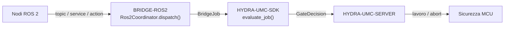

<!-- =============================================================================
HYDRA-UMC-BRIDGE-ROS2 - Ponte di coordinamento bidirezionale con ROS 2
Copyright (C) 2026 JuanenRac (Electro Hobby 3D) <electrohobby3d@gmail.com>
GPL-3.0-or-later - see LICENSE
============================================================================= -->

<p align="center">
  
</p>

# 🤖 HYDRA-UMC-BRIDGE-ROS2

<p align="center"><a href="README.md">🇺🇸 English</a> | <a href="README_spa.md">🇪🇸 Español</a> | <a href="README_fra.md">🇫🇷 Français</a> | 🇮🇹 <b>Italiano</b> | <a href="README_deu.md">🇩🇪 Deutsch</a> | <a href="README_zho.md">🇨🇳 简体中文</a> | <a href="README_jpn.md">🇯🇵 日本語</a></p>

### 🔗 Confine di coordinamento privo di dipendenze tra HYDRA-UMC e ROS 2

<p align="left">
  
  
  
</p>

---

## 1. 🛠️ PANORAMICA TECNICA

**HYDRA-UMC-BRIDGE-ROS2** è il confine di coordinamento bidirezionale e di alto livello tra HYDRA-UMC e ROS 2. Mappa l'osservazione continua su un topic, l'ispezione immediata su un service, e il lavoro di cella di lunga durata su un'action annullabile. Non è un nodo di controllo motore e non può aggirare HYDRA-UMC-SERVER, i limiti dell'MCU, i watchdog o l'E-STOP.

Appartiene alla famiglia **External Automation Bridges**: un insieme di repository fratelli (CNC, LASER, OPENPNP, PRINTER3D, ROS2) che condividono lo stesso contratto di sicurezza di `HYDRA-UMC-SDK`, così nessun ponte può inventare una propria definizione di "sicuro per lavorare".

### Caratteristiche principali:
* ✅ **Nucleo di coordinamento privo di dipendenze, reale:** `coordinator.py` — `Ros2Coordinator` non importa affatto `rclpy`; è Python semplice deliberatamente, testabile su qualsiasi host senza un'installazione di ROS 2. *(implementato, testato in `tests/test_coordinator.py`)*
* ✅ **Mappatura a tre interfacce, reale:** tre attributi di classe fissi riservano il tipo esatto di interfaccia ROS 2 per ciascuno scopo — `/hydra_umc/machine_state` (topic, stato continuo), `/hydra_umc/inspect_cell` (service, ispezione breve), `/hydra_umc/execute_cell_job` (action, lavoro annullabile). *(implementato)*
* ✅ **Porta di sicurezza condivisa, reale:** ogni lavoro inviato tramite `Ros2Coordinator.dispatch()` viene valutato da `evaluate_job()` del `bridge_contract` di `HYDRA-UMC-SDK`, la stessa porta usata da tutti i ponti fratelli e da HYDRA-UMC-SERVER; una fase produttiva richiede una macchina esterna `IDLE` e una cella HYDRA-UMC `READY`, mentre `ABORT` resta richiedibile durante un guasto. *(implementato)*
* ✅ **Instradamento delle fasi chiuso ed evidenza statica:** le fasi produttive si mappano solo all'azione di lavoro pianificata, `ABORT` si mappa a `/hydra_umc/request_safe_stop` e una futura fase SDK sconosciuta viene negata. `inspect_interface_plan.py` emette il piano statico di schema `1.1` — incluso il vero QoS di durabilità `transient_local` di cui il topic di stato ha bisogno (il sostituto proprio di ROS 2 per il publisher "latched" di ROS 1, studiato su design.ros2.org/articles/qos.html) — senza importare `rclpy` né contattare DDS. *(implementato, testato)*
* ✅ **Trasporto `rclpy` reale e parziale:** `rclpy_transport.py` collega le 2 interfacce con un vero tipo di messaggio ROS 2 standard già oggi — `Ros2SafeStopClient` (un vero client `std_srvs/Trigger`) e `Ros2StateSubscriber` (un vero subscriber `std_msgs/String`, che usa il vero QoS di durabilità `transient_local`). *(implementato, testato in `tests/test_rclpy_transport.py`)*
* ✅ **Build/test non mutante:** `build-test.bat`/`.sh` compilano il codice sorgente ed eseguono test unitari deterministici senza cambiare versione o CHANGELOG. *(implementato, vedi COMPILAZIONE ED ESECUZIONE più sotto)*
* 🔜 **Contratti `.srv`/`.action` personalizzati per `inspect_service`/`job_action`** — questi non hanno un vero tipo di messaggio ROS 2 standard, quindi un client per essi richiede che questo repository definisca prima il proprio pacchetto di interfaccia. *(pianificato)*

---

## 2. 🔄 FLUSSO DI COORDINAMENTO ROS 2



---

## 3. 🧱 ARCHITETTURA E DECISIONI DI PROGETTAZIONE

* **Perché `coordinator.py` non ha alcuna dipendenza da `rclpy`.** Il proprio docstring del modulo lo afferma deliberatamente: "può essere testato su qualsiasi host e diventa un nodo ROS 2 solo tramite un adattatore distribuito separatamente". Questo mantiene testabile in CI la logica di coordinamento rilevante per la sicurezza senza un'installazione di ROS 2, e permette di scegliere e validare l'adattatore in modo indipendente, in seguito.
* **Perché tre tipi di interfaccia distinti invece di un canale generico.** `state_topic`, `inspect_service` e `job_action` corrispondono deliberatamente alla semantica propria di ROS 2: la pubblicazione continua dello stato non richiede richiesta/risposta (topic), un'ispezione rapida richiede una risposta sincrona (service), e il lavoro di cella deve poter essere annullato in corso (action) — ridurre tutto a un solo canale farebbe perdere questa distinzione.
* **Perché `Ros2Coordinator.dispatch()` incanala comunque ogni lavoro attraverso la porta condivisa `evaluate_job()`.** ROS 2 è semplicemente un altro client dello stesso `bridge_contract` usato da CNC, LASER, OPENPNP e PRINTER3D — non ottiene alcuna esenzione speciale dalla logica IDLE/READY applicata da tutti gli altri ponti e da HYDRA-UMC-SERVER.
* **Perché `ABORT` resta richiedibile durante un guasto.** Il requisito di fase produttiva della porta (`IDLE` + `READY`) non viene deliberatamente applicato allo stesso modo a una richiesta di abort — un operatore o un nodo ROS 2 deve sempre poter richiedere un arresto controllato, anche in pieno guasto.
* **Perché l'adattatore `rclpy` e i contratti ROS `.msg`/`.srv`/`.action` non sono ancora in questo repository.** Vincolarsi a definizioni specifiche di messaggi/servizi/azioni prima che un ambiente ROS 2 reale sia selezionato e testato rischierebbe di incorporare ipotesi che questo nucleo locale privo di dipendenze non può verificare.
* **Come si inserisce nel resto dell'ecosistema.** BRIDGE-ROS2 si trova tra i nodi ROS 2 e `HYDRA-UMC-SDK` → `HYDRA-UMC-SERVER` → sicurezza MCU: è un confine di coordinamento, mai un nodo di controllo motore, e non può aggirare HYDRA-UMC-SERVER, i limiti dell'MCU, i watchdog o l'E-STOP.

---

## 📂 STRUTTURA DELLE DIRECTORY

```text
HYDRA-UMC-BRIDGE-ROS2/
├── src/
│   └── hydra_umc_bridge_ros2/
│       ├── __init__.py
│       ├── coordinator.py       # Ros2Coordinator: porta topic/service/action priva di dipendenze
│       ├── rclpy_transport.py   # Trasporto rclpy reale - solo le 2 interfacce con un tipo di messaggio ROS 2 reale e standard
│       └── mqtt_transport.py    # Trasporto MQTT reale del broker per la logica già reale di questo bridge
├── tests/
│   ├── test_coordinator.py      # Test unitari deterministici del nucleo di coordinamento
│   ├── test_rclpy_transport.py  # Test di trasporto rclpy reale contro un nodo/publisher fittizio
│   ├── test_mqtt_transport.py   # Test di forma comando/stato MQTT contro un client broker fittizio
│   └── fixtures/
│       ├── interface-plan-v1.json    # Fixture di compatibilità interfaccia schema-1.0
│       └── interface-plan-v1.1.json  # Fixture pubblica di compatibilità interfaccia schema-1.1
├── tools/
│   ├── build_test.py            # Compilatore + esecutore di test non mutante (build-test.bat/.sh)
│   ├── inspect_interface_plan.py # Emette il JSON statico `plan-only` dello schema di interfaccia 1.1
│   ├── ci_validate.py           # Base CI priva di dipendenze e non distruttiva (usata da .github/workflows/ci.yml)
│   └── bump_version.py          # Sincronizza pyproject.toml, manifesto e CHANGELOG.md
├── docs/
│   └── BRIDGE_GUIDE.md          # Ambito, piattaforme compatibili, script, porta di accettazione hardware
├── images/
│   └── HYDRA_UMC_BANNER.svg     # Banner del README
├── build-test.bat / build-test.sh  # Solo valida, non modifica mai il repository
├── build.bat / build.sh            # Valida e, solo in caso di successo, aggiorna versione + CHANGELOG
├── pyproject.toml               # Metadati del pacchetto; dipende da HYDRA-UMC-SDK (git)
├── hydra-umc.project.json       # Manifesto dell'ecosistema (versione, maturità, famiglia)
├── CHANGELOG.md
├── CODE_OF_CONDUCT.md / CONTRIBUTING.md / SECURITY.md / SUPPORT.md
├── LICENSE / LICENSE.md
└── README.md / README_*.md      # Questo file e le sue 6 traduzioni
```

---

## 4. ⚙️ COMPILAZIONE ED ESECUZIONE

Richiede Python 3.11+. `tools/build_test.py` si aspetta che `HYDRA-UMC-SDK` sia clonato come directory fratella (`../HYDRA-UMC-SDK`) o indicato tramite la variabile d'ambiente `HYDRA_UMC_SDK_ROOT`.

```bash
# Windows
build-test.bat      # solo validazione — nessun cambio di versione/CHANGELOG
build.bat            # valida e, se ha successo, aggiorna versione + CHANGELOG

# Linux/macOS
bash build-test.sh
bash build.sh
```

`build-test` compila ogni modulo sotto `src/` con `py_compile` ed esegue l'intera suite `unittest` (`tests/test_coordinator.py`) — in modo deterministico, senza installazione di ROS 2, senza rete e senza cambio di versione/CHANGELOG. `build` esegue prima quella stessa validazione e, solo in caso di successo, chiama `tools/bump_version.py` per sincronizzare la versione in `pyproject.toml`, `hydra-umc.project.json` e `CHANGELOG.md`. Non esiste ancora un comando `run` hardware reale — serve un deployment ROS 2 validato.

---

## ✅ STATO ATTUALE E PROSSIMI PASSI

**Reale oggi:** versione `0.0.5`, funzionale come nucleo di coordinamento privo di dipendenze (`Ros2Coordinator`) con una suite `unittest` deterministica di ventuno test che copre il nucleo di coordinamento, il trasporto MQTT e il trasporto rclpy, instradamento delle fasi chiuso, uno schema di interfaccia statico `plan-only` che dichiara il vero QoS di durabilità `transient_local` di cui il topic di stato ha bisogno, un trasporto `rclpy` reale (importato in modo lazy) per le 2 interfacce con un vero tipo di messaggio ROS 2 standard, e script build-test non mutanti collegati alla CI con un checkout dell'SDK.

**Confine di integrazione:** questo ponte è solo un confine di coordinamento — non è un nodo di controllo motore, e non può aggirare HYDRA-UMC-SERVER, i limiti dell'MCU, i watchdog o l'E-STOP; ogni lavoro inviato passa comunque attraverso la stessa porta condivisa usata da tutti i ponti fratelli.

**Ancora da fare:** nessuna rete ROS, robot o attuatore fisico è ancora stato validato — l'adattatore `rclpy` e i contratti ROS `.msg`/`.srv`/`.action` concreti saranno introdotti solo dopo la selezione e il test di un ambiente ROS 2 reale.

---

## 🔗 Progetti Correlati

Questo progetto fa parte dell'ecosistema robotico HYDRA-UMC dello stesso autore (JuanenRac / Electro Hobby 3D). Vale la pena conoscerlo, poiché una richiesta potrebbe in realtà riguardare uno di questi invece di questo repository.

**Progetto Padre**
- **[HYDRA-UMC-SERVER](https://github.com/JuanenRac/HYDRA-UMC-SERVER)** — il vero backend headless (REST/WebSocket) con cui parla davvero ogni client di controllo; il confine autenticato dell'ecosistema a cui questo bridge riporta una volta che ogni comando ha superato la barriera di sicurezza locale di questo stesso bridge.

**Progetti Fratelli** — parlano anch'essi con la stessa API di HYDRA-UMC-SERVER, ciascuno come proprio client
- **[HYDRA-UMC-STUDIO](https://github.com/JuanenRac/HYDRA-UMC-STUDIO)** — dashboard di controllo web con visualizzazione 3D multi-robot in tempo reale.
- **[HYDRA-UMC-SUITE](https://github.com/JuanenRac/HYDRA-UMC-SUITE)** — centro di comando sciame desktop (PySide6) per più server contemporaneamente, pacchettizzato come eseguibile standalone.
- **[HYDRA-UMC-ANDROID-CONTROL](https://github.com/JuanenRac/HYDRA-UMC-ANDROID-CONTROL)** — app di controllo nativa per Android con login biometrico e un companion Wear OS abbinato.
- **[HYDRA-UMC-IOS-CONTROL](https://github.com/JuanenRac/HYDRA-UMC-IOS-CONTROL)** — app di controllo per iOS/iPadOS (Flutter) con sincronizzazione WebSocket in tempo reale.
- **[HYDRA-UMC-DSI](https://github.com/JuanenRac/HYDRA-UMC-DSI)** — interfaccia touch nativa per il touchscreen DSI da 7" a bordo, incorporata direttamente nel CM5.
- **[HYDRA-UMC-BRIDGE-AMR](https://github.com/JuanenRac/HYDRA-UMC-BRIDGE-AMR)** — barriera di coordinamento per flotte AGV/AMR tramite un publisher MQTT VDA 5050 reale.
- **[HYDRA-UMC-BRIDGE-CNC](https://github.com/JuanenRac/HYDRA-UMC-BRIDGE-CNC)** — coordinatore ad alto livello per celle CNC con accesso reale a stato/byte di controllo GRBL.
- **[HYDRA-UMC-BRIDGE-DROIDS](https://github.com/JuanenRac/HYDRA-UMC-BRIDGE-DROIDS)** — barriera di coordinamento per droidi con zampe/umanoidi, con un vero mittente di comandi per Boston Dynamics Spot.
- **[HYDRA-UMC-BRIDGE-LASER](https://github.com/JuanenRac/HYDRA-UMC-BRIDGE-LASER)** — coordinatore di sicurezza per celle laser che legge 3 salvaguardie GPIO reali di chiave/involucro/interblocco.
- **[HYDRA-UMC-BRIDGE-OPENPNP](https://github.com/JuanenRac/HYDRA-UMC-BRIDGE-OPENPNP)** — coordinatore ad alto livello sicuro per il flusso schede del pick-and-place OpenPnP.
- **[HYDRA-UMC-BRIDGE-PRINTER3D](https://github.com/JuanenRac/HYDRA-UMC-BRIDGE-PRINTER3D)** — barriera di coordinamento sicura per stampanti 3D Moonraker/Klipper, con comandi di lavoro reali e controllati.
- **[HYDRA-UMC-BRIDGE-UAV](https://github.com/JuanenRac/HYDRA-UMC-BRIDGE-UAV)** — barriera di coordinamento per UAV dotati di fotocamera, con un vero mittente di comandi MAVLink.

**Direttamente Correlati**
- **[HYDRA-UMC-SDK](https://github.com/JuanenRac/HYDRA-UMC-SDK)** — il contratto JSON-Schema condiviso e la barriera di sicurezza contro cui ogni bridge valida i propri comandi.
- **[HYDRA-UMC-MQTT-BROKER](https://github.com/JuanenRac/HYDRA-UMC-MQTT-BROKER)** — il vero trasporto di `mqtt_transport.py` per i propri topic `hydra/bridges/ros2/...` di questo bridge — la barriera di lavoro solo-piano, una vera chiamata di arresto sicuro `std_srvs/Trigger`, e il vero topic di stato ROS 2 ripubblicato come sempre previsto dall'adattatore `rclpy_transport.py` distribuito separatamente; vedi il proprio `docs/BRIDGE_TOPICS.md` di quel repository.
- **[HYDRA-UMC-HIL-BRIDGE](https://github.com/JuanenRac/HYDRA-UMC-HIL-BRIDGE)** — percorso di evidenza hardware-in-the-loop per un deployment ROS 2 reale.

**Fa Anche Parte dell'Ecosistema**

*Hardware e Piattaforma di Base*
- **[HYDRA-UMC](https://github.com/JuanenRac/HYDRA-UMC)** — la scheda madre fisica del braccio robotico: host CM5 + coprocessore STM32H745 dual-core, che coordina fino a 8 bracci utensile via CAN-OTA/SPI-OTA.
- **[HYDRA-UMC-OS](https://github.com/JuanenRac/HYDRA-UMC-OS)** — livello prodotto riproducibile su Raspberry Pi OS per il CM5: agente in sola lettura, config/profili validati, provisioning WiFi al primo contatto.

*Backend Centrale e Client*
- **[HYDRA-UMC-EDITOR-URDF](https://github.com/JuanenRac/HYDRA-UMC-EDITOR-URDF)** — creatore/editor grafico desktop di URDF che invia i modelli finiti al catalogo di STUDIO.

*Piattaforma Strumenti URTC*
- **[URTC](https://github.com/JuanenRac/URTC)** — firmware per la scheda fisica dell'Universal Robot Tool Controller, oltre 25 profili utensile su bus CAN.
- **[URTC-FLASHER](https://github.com/JuanenRac/URTC-FLASHER)** — strumento desktop con GUI per il flashing delle schede URTC, CAN-OTA più SWD/JTAG a chip intero.
- **[URTC-TESTER](https://github.com/JuanenRac/URTC-TESTER)** — strumento desktop di diagnostica CAN-bus dal vivo per schede URTC, un pannello per profilo utensile.
- **[URTC-WEB-STUDIO](https://github.com/JuanenRac/URTC-WEB-STUDIO)** — alternativa basata su browser a URTC-TESTER tramite la Web Serial API, senza installazione locale.

*Nodo IA Visione (Hailo-8)*
- **[HYDRA-UMC-VISION-NODE](https://github.com/JuanenRac/HYDRA-UMC-VISION-NODE)** — hub di integrazione per la pipeline di visione Hailo-8, con un vero controllo di prontezza hardware per fase.
- **[HYDRA-UMC-DETECTION-HEF](https://github.com/JuanenRac/HYDRA-UMC-DETECTION-HEF)** — registro reale di modelli compilati con verifica di caricamento sicuro per architettura Hailo/checksum.
- **[HYDRA-UMC-VISION-STREAMER](https://github.com/JuanenRac/HYDRA-UMC-VISION-STREAMER)** — generatore reale di pipeline GStreamer + config MediaMTX, con una vera barriera di integrazione HailoRT.
- **[HYDRA-UMC-VISUAL-SERVOING-API](https://github.com/JuanenRac/HYDRA-UMC-VISUAL-SERVOING-API)** — vera legge di correzione Position-Based Visual Servoing, con cancello di sicurezza sullo stato di zona a monte.
- **[HYDRA-UMC-SAFETY-ZONES](https://github.com/JuanenRac/HYDRA-UMC-SAFETY-ZONES)** — vero controllo di violazione zona e richiesta E-STOP, con imposizione della freschezza di calibrazione.

*Nodo IA Cognitivo (Hailo-10)*
- **[HYDRA-UMC-COGNITIVE-NODE](https://github.com/JuanenRac/HYDRA-UMC-COGNITIVE-NODE)** — hub di integrazione per la pipeline cognitiva Hailo-10 (orchestrazione LLM/VLA/voce).
- **[HYDRA-UMC-VLA-ENGINE](https://github.com/JuanenRac/HYDRA-UMC-VLA-ENGINE)** — vera codifica/decodifica di token d'azione e generazione di traiettoria per un modello Vision-Language-Action.
- **[HYDRA-UMC-VOICE-UI](https://github.com/JuanenRac/HYDRA-UMC-VOICE-UI)** — vero front-end vocale (VAD + parser di intenti) con un relay verso Watch limitato e soggetto a conferma.
- **[HYDRA-UMC-SEMANTIC-PLANNER](https://github.com/JuanenRac/HYDRA-UMC-SEMANTIC-PLANNER)** — vera scomposizione dei task basata su regole e recupero semantico degli errori sui codici errore MCU.
- **[HYDRA-UMC-DOCS-QA](https://github.com/JuanenRac/HYDRA-UMC-DOCS-QA)** — vera ricerca documentale TF-IDF (solo libreria standard) sui documenti Markdown di questo ecosistema.

*Orchestrazione e Sciame*
- **[HYDRA-UMC-ORCHESTRATOR](https://github.com/JuanenRac/HYDRA-UMC-ORCHESTRATOR)** — hub di integrazione con un vero contratto di health-report gRPC/Protobuf e una macchina a stati di missione.
- **[HYDRA-UMC-JOB-DISPATCHER](https://github.com/JuanenRac/HYDRA-UMC-JOB-DISPATCHER)** — vera coda di lavori basata su priorità con deduplicazione, su una vera API HTTP.
- **[HYDRA-UMC-NODE-HEALING](https://github.com/JuanenRac/HYDRA-UMC-NODE-HEALING)** — vero watchdog di salute della flotta basato su gRPC, con retry/backoff e rilevamento di discrepanza d'identità.
- **[HYDRA-UMC-PATH-PLANNER-3D](https://github.com/JuanenRac/HYDRA-UMC-PATH-PLANNER-3D)** — vero pianificatore di percorsi 3D basato su RRT, con vera validazione delle collisioni ostacolo/spazio di lavoro.
- **[HYDRA-UMC-SWARM-SYNC](https://github.com/JuanenRac/HYDRA-UMC-SWARM-SYNC)** — vera sincronizzazione di stato CRDT LWW-Element-Map, con property test per la convergenza multi-cella.

*Gemello Digitale e Simulazione*
- **[HYDRA-UMC-TWIN](https://github.com/JuanenRac/HYDRA-UMC-TWIN)** — hub di integrazione per il motore di gemello digitale, con un vero contratto di sincronizzazione per compatibilità di versione.
- **[HYDRA-UMC-PHYSICS-REPLICA](https://github.com/JuanenRac/HYDRA-UMC-PHYSICS-REPLICA)** — vera cinematica diretta e validazione dei limiti articolari su un vero sottoinsieme URDF.
- **[HYDRA-UMC-SYNTHETIC-DATA-GEN](https://github.com/JuanenRac/HYDRA-UMC-SYNTHETIC-DATA-GEN)** — vero generatore procedurale di scene 2D con esportazione di annotazioni YOLO/COCO.

*Dati e Analisi*
- **[HYDRA-UMC-DATALAKE](https://github.com/JuanenRac/HYDRA-UMC-DATALAKE)** — vero archivio di serie temporali basato su sqlite3, con una vera API HTTP di ingestione/query.
- **[HYDRA-UMC-ANOMALY-DETECTOR](https://github.com/JuanenRac/HYDRA-UMC-ANOMALY-DETECTOR)** — vero rilevatore di anomalie FFT + baseline statistica, con monitoraggio della deriva.
- **[HYDRA-UMC-PRODUCTION-REPORTS](https://github.com/JuanenRac/HYDRA-UMC-PRODUCTION-REPORTS)** — vero calcolo OEE/disponibilità sullo storico di DATALAKE, con esportazione CSV riproducibile.
- **[HYDRA-UMC-TELEMETRY-COLLECTOR](https://github.com/JuanenRac/HYDRA-UMC-TELEMETRY-COLLECTOR)** — vera pipeline di ingestione CAN/WebSocket verso DATALAKE, con deduplicazione per sequenza.

*Gateway Industriale*
- **[HYDRA-UMC-GATEWAY-INDUSTRIAL](https://github.com/JuanenRac/HYDRA-UMC-GATEWAY-INDUSTRIAL)** — hub di integrazione che inoltra ai protocolli industriali, con un vero livello di allowlist dei comandi/backpressure.
- **[HYDRA-UMC-OPCUA-SERVER](https://github.com/JuanenRac/HYDRA-UMC-OPCUA-SERVER)** — vero spazio di indirizzi OPC-UA, verificato con una vera sessione client del protocollo binario.
- **[HYDRA-UMC-MTCONNECT-ADAPTER](https://github.com/JuanenRac/HYDRA-UMC-MTCONNECT-ADAPTER)** — veri endpoint XML `/probe` e `/current` di MTConnect, con output in modalità degradata.

*Strumenti Complementari e Operazioni dell'Ecosistema*
- **[HYDRA-UMC-DASHBOARD-AI](https://github.com/JuanenRac/HYDRA-UMC-DASHBOARD-AI)** — pannelli Smart Summaries e Anomaly Highlighting su DATALAKE/ANOMALY-DETECTOR, con un fallback statistico onesto.
- **[HYDRA-UMC-TOOL-CLI](https://github.com/JuanenRac/HYDRA-UMC-TOOL-CLI)** — CLI di flotta con un vero e stabile contratto di exit-code, un client live reale della stessa API di HYDRA-UMC-SERVER.
- **[HYDRA-UMC-WATCH](https://github.com/JuanenRac/HYDRA-UMC-WATCH)** — app companion WearOS con avvisi aptici reali e un relay vocale verso il telefono abbinato.
- **[URTC-SMART-RACK](https://github.com/JuanenRac/URTC-SMART-RACK)** — firmware per un rack di montaggio schede con decodifica reale dell'ID utensile e logica di preriscaldamento Smart Idle.
- **[URTC-VISION-TOOL](https://github.com/JuanenRac/URTC-VISION-TOOL)** — firmware più un vero companion di visione Python per una testa utensile di ispezione termica/RGB.
- **[HYDRA-UMC-UPDATER](https://github.com/JuanenRac/HYDRA-UMC-UPDATER)** — strumento amministrativo desktop che scopre, clona e aggiorna ogni repository di questo ecosistema.

## 👤 AUTORE
**JuanenRac** (Electro Hobby 3D)
📧 electrohobby3d@gmail.com
📺 [youtube.com/@electrohobby3d](https://youtube.com/@electrohobby3d)

## 📜 LICENZA
GPL-3.0 - Vedi LICENSE per i dettagli.
