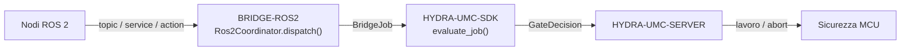

<!-- =============================================================================
HYDRA-UMC-BRIDGE-ROS2 - Ponte di coordinamento bidirezionale con ROS 2
Copyright (C) 2026 JuanenRac (Electro Hobby 3D) <electrohobby3d@gmail.com>
GPL-3.0-or-later - see LICENSE
============================================================================= -->

<p align="center">
  
</p>

# 🤖 HYDRA-UMC-BRIDGE-ROS2

<p align="center"><a href="README.md">🇺🇸 English</a> | <a href="README_spa.md">🇪🇸 Español</a> | <a href="README_fra.md">🇫🇷 Français</a> | 🇮🇹 <b>Italiano</b> | <a href="README_deu.md">🇩🇪 Deutsch</a> | <a href="README_zho.md">🇨🇳 简体中文</a> | <a href="README_jpn.md">🇯🇵 日本語</a></p>

### 🔗 Confine di coordinamento privo di dipendenze tra HYDRA-UMC e ROS 2

<p align="left">
  
  
  
</p>

---

## 1. 🛠️ PANORAMICA TECNICA

**HYDRA-UMC-BRIDGE-ROS2** è il confine di coordinamento bidirezionale e di alto livello tra HYDRA-UMC e ROS 2. Mappa l'osservazione continua su un topic, l'ispezione immediata su un service, e il lavoro di cella di lunga durata su un'action annullabile. Non è un nodo di controllo motore e non può aggirare HYDRA-UMC-SERVER, i limiti dell'MCU, i watchdog o l'E-STOP.

Appartiene alla famiglia **External Automation Bridges**: un insieme di repository fratelli (CNC, LASER, OPENPNP, PRINTER3D, ROS2) che condividono lo stesso contratto di sicurezza di `HYDRA-UMC-SDK`, così nessun ponte può inventare una propria definizione di "sicuro per lavorare".

### Caratteristiche principali:
* ✅ **Nucleo di coordinamento privo di dipendenze, reale:** `coordinator.py` — `Ros2Coordinator` non importa affatto `rclpy`; è Python semplice deliberatamente, testabile su qualsiasi host senza un'installazione di ROS 2. *(implementato, testato in `tests/test_coordinator.py`)*
* ✅ **Mappatura a tre interfacce, reale:** tre attributi di classe fissi riservano il tipo esatto di interfaccia ROS 2 per ciascuno scopo — `/hydra_umc/machine_state` (topic, stato continuo), `/hydra_umc/inspect_cell` (service, ispezione breve), `/hydra_umc/execute_cell_job` (action, lavoro annullabile). *(implementato)*
* ✅ **Porta di sicurezza condivisa, reale:** ogni lavoro inviato tramite `Ros2Coordinator.dispatch()` viene valutato da `evaluate_job()` del `bridge_contract` di `HYDRA-UMC-SDK`, la stessa porta usata da tutti i ponti fratelli e da HYDRA-UMC-SERVER; una fase produttiva richiede una macchina esterna `IDLE` e una cella HYDRA-UMC `READY`, mentre `ABORT` resta richiedibile durante un guasto. *(implementato)*
* ✅ **Instradamento delle fasi chiuso ed evidenza statica:** le fasi produttive si mappano solo all'azione di lavoro pianificata, `ABORT` si mappa a `/hydra_umc/request_safe_stop` e una futura fase SDK sconosciuta viene negata. `inspect_interface_plan.py` emette il piano statico di schema `1.1` — incluso il vero QoS di durabilità `transient_local` di cui il topic di stato ha bisogno (il sostituto proprio di ROS 2 per il publisher "latched" di ROS 1, studiato su design.ros2.org/articles/qos.html) — senza importare `rclpy` né contattare DDS. *(implementato, testato)*
* ✅ **Trasporto `rclpy` reale e parziale:** `rclpy_transport.py` collega le 2 interfacce con un vero tipo di messaggio ROS 2 standard già oggi — `Ros2SafeStopClient` (un vero client `std_srvs/Trigger`) e `Ros2StateSubscriber` (un vero subscriber `std_msgs/String`, che usa il vero QoS di durabilità `transient_local`). *(implementato, testato in `tests/test_rclpy_transport.py`)*
* ✅ **Build/test non mutante:** `build-test.bat`/`.sh` compilano il codice sorgente ed eseguono test unitari deterministici senza cambiare versione o CHANGELOG. *(implementato, vedi COMPILAZIONE ED ESECUZIONE più sotto)*
* 🔜 **Contratti `.srv`/`.action` personalizzati per `inspect_service`/`job_action`** — questi non hanno un vero tipo di messaggio ROS 2 standard, quindi un client per essi richiede che questo repository definisca prima il proprio pacchetto di interfaccia. *(pianificato)*

---

## 2. 🔄 FLUSSO DI COORDINAMENTO ROS 2



---

## 3. 🧱 ARCHITETTURA E DECISIONI DI PROGETTAZIONE

* **Perché `coordinator.py` non ha alcuna dipendenza da `rclpy`.** Il proprio docstring del modulo lo afferma deliberatamente: "può essere testato su qualsiasi host e diventa un nodo ROS 2 solo tramite un adattatore distribuito separatamente". Questo mantiene testabile in CI la logica di coordinamento rilevante per la sicurezza senza un'installazione di ROS 2, e permette di scegliere e validare l'adattatore in modo indipendente, in seguito.
* **Perché tre tipi di interfaccia distinti invece di un canale generico.** `state_topic`, `inspect_service` e `job_action` corrispondono deliberatamente alla semantica propria di ROS 2: la pubblicazione continua dello stato non richiede richiesta/risposta (topic), un'ispezione rapida richiede una risposta sincrona (service), e il lavoro di cella deve poter essere annullato in corso (action) — ridurre tutto a un solo canale farebbe perdere questa distinzione.
* **Perché `Ros2Coordinator.dispatch()` incanala comunque ogni lavoro attraverso la porta condivisa `evaluate_job()`.** ROS 2 è semplicemente un altro client dello stesso `bridge_contract` usato da CNC, LASER, OPENPNP e PRINTER3D — non ottiene alcuna esenzione speciale dalla logica IDLE/READY applicata da tutti gli altri ponti e da HYDRA-UMC-SERVER.
* **Perché `ABORT` resta richiedibile durante un guasto.** Il requisito di fase produttiva della porta (`IDLE` + `READY`) non viene deliberatamente applicato allo stesso modo a una richiesta di abort — un operatore o un nodo ROS 2 deve sempre poter richiedere un arresto controllato, anche in pieno guasto.
* **Perché l'adattatore `rclpy` e i contratti ROS `.msg`/`.srv`/`.action` non sono ancora in questo repository.** Vincolarsi a definizioni specifiche di messaggi/servizi/azioni prima che un ambiente ROS 2 reale sia selezionato e testato rischierebbe di incorporare ipotesi che questo nucleo locale privo di dipendenze non può verificare.
* **Come si inserisce nel resto dell'ecosistema.** BRIDGE-ROS2 si trova tra i nodi ROS 2 e `HYDRA-UMC-SDK` → `HYDRA-UMC-SERVER` → sicurezza MCU: è un confine di coordinamento, mai un nodo di controllo motore, e non può aggirare HYDRA-UMC-SERVER, i limiti dell'MCU, i watchdog o l'E-STOP.

---

## 📂 STRUTTURA DELLE DIRECTORY

```text
HYDRA-UMC-BRIDGE-ROS2/
├── src/
│   └── hydra_umc_bridge_ros2/
│       ├── __init__.py
│       └── coordinator.py       # Ros2Coordinator: porta topic/service/action priva di dipendenze
├── tests/
│   ├── test_coordinator.py      # Test unitari deterministici del nucleo di coordinamento
│   └── fixtures/interface-plan-v1.json # Fixture pubblica di compatibilità interfaccia schema-1.0
├── tools/
│   ├── build_test.py            # Compilatore + esecutore di test non mutante (build-test.bat/.sh)
│   └── bump_version.py          # Sincronizza pyproject.toml, manifesto e CHANGELOG.md
├── build-test.bat / build-test.sh  # Solo valida, non modifica mai il repository
├── build.bat / build.sh            # Valida e, solo in caso di successo, aggiorna versione + CHANGELOG
├── pyproject.toml               # Metadati del pacchetto; dipende da HYDRA-UMC-SDK (git)
├── hydra-umc.project.json       # Manifesto dell'ecosistema (versione, maturità, famiglia)
├── CHANGELOG.md
├── CODE_OF_CONDUCT.md / CONTRIBUTING.md / SECURITY.md / SUPPORT.md
├── LICENSE / LICENSE.md
└── README.md / README_*.md      # Questo file e le sue 6 traduzioni
```

---

## 4. ⚙️ COMPILAZIONE ED ESECUZIONE

Richiede Python 3.11+. `tools/build_test.py` si aspetta che `HYDRA-UMC-SDK` sia clonato come directory fratella (`../HYDRA-UMC-SDK`) o indicato tramite la variabile d'ambiente `HYDRA_UMC_SDK_ROOT`.

```bash
# Windows
build-test.bat      # solo validazione — nessun cambio di versione/CHANGELOG
build.bat            # valida e, se ha successo, aggiorna versione + CHANGELOG

# Linux/macOS
bash build-test.sh
bash build.sh
```

`build-test` compila ogni modulo sotto `src/` con `py_compile` ed esegue l'intera suite `unittest` (`tests/test_coordinator.py`) — in modo deterministico, senza installazione di ROS 2, senza rete e senza cambio di versione/CHANGELOG. `build` esegue prima quella stessa validazione e, solo in caso di successo, chiama `tools/bump_version.py` per sincronizzare la versione in `pyproject.toml`, `hydra-umc.project.json` e `CHANGELOG.md`. Non esiste ancora un comando `run` hardware reale — serve un deployment ROS 2 validato.

---

## ✅ STATO ATTUALE E PROSSIMI PASSI

**Reale oggi:** versione `0.0.2`, funzionale come nucleo di coordinamento privo di dipendenze (`Ros2Coordinator`) con cinque test di sicurezza locali deterministici, instradamento delle fasi chiuso, uno schema di interfaccia statico `plan-only` e script build-test non mutanti collegati alla CI con un checkout dell'SDK.

**Confine di integrazione:** questo ponte è solo un confine di coordinamento — non è un nodo di controllo motore, e non può aggirare HYDRA-UMC-SERVER, i limiti dell'MCU, i watchdog o l'E-STOP; ogni lavoro inviato passa comunque attraverso la stessa porta condivisa usata da tutti i ponti fratelli.

**Ancora da fare:** nessuna rete ROS, robot o attuatore fisico è ancora stato validato — l'adattatore `rclpy` e i contratti ROS `.msg`/`.srv`/`.action` concreti saranno introdotti solo dopo la selezione e il test di un ambiente ROS 2 reale.

---

## 🔗 PROGETTI CORRELATI

Questo progetto fa parte di un ecosistema robotico più ampio dello stesso autore (JuanenRac / Electro Hobby 3D), che copre firmware, software di controllo, nodi IA e strumenti di flotta. Vale la pena saperlo, perché una richiesta potrebbe in realtà riguardare uno di questi progetti anziché questo repository.

### Direttamente correlati

- **[HYDRA-UMC-SDK](https://github.com/JuanenRac/HYDRA-UMC-SDK)** — il contratto condiviso di lavori e sicurezza attraverso cui questo ponte (e tutti gli altri) valuta i propri lavori.
- **[HYDRA-UMC-SERVER](https://github.com/JuanenRac/HYDRA-UMC-SERVER)** — il confine autenticato dell'ecosistema a cui questo ponte riporta.
- **[HYDRA-UMC-MQTT-BROKER](https://github.com/JuanenRac/HYDRA-UMC-MQTT-BROKER)** — il vero trasporto di `mqtt_transport.py` per i topic `hydra/bridges/ros2/...` propri di questo ponte (la porta di lavoro solo-a-piano, una vera chiamata di arresto sicuro `std_srvs/Trigger`, e il vero topic di stato ROS 2 ripubblicato come l'"adattatore distribuito separatamente" che `rclpy_transport.py` ha sempre anticipato) - vedi il proprio `docs/BRIDGE_TOPICS.md` di quel repository.
- **[HYDRA-UMC-HIL-BRIDGE](https://github.com/JuanenRac/HYDRA-UMC-HIL-BRIDGE)** — via di evidenza hardware-in-the-loop per un deployment ROS 2 reale.

### Resto dell'ecosistema

**Piattaforma HYDRA-UMC** — la micro-fabbrica multi-robot per cui questo ponte coordina gli ausiliari
- **[HYDRA-UMC](https://github.com/JuanenRac/HYDRA-UMC)** — la scheda madre CM5 + STM32H745 che orchestra fino a 8 bracci robotici.
- **[HYDRA-UMC-SERVER](https://github.com/JuanenRac/HYDRA-UMC-SERVER)** — il backend Express/WebSocket con cui parlano tutti i client di controllo e i ponti.
- **[HYDRA-UMC-STUDIO](https://github.com/JuanenRac/HYDRA-UMC-STUDIO)** — dashboard di controllo web, visualizzazione 3D multi-robot.

**External Automation Bridges** — repository fratelli che condividono questa stessa porta di lavoro `HYDRA-UMC-SDK`
- **[HYDRA-UMC-BRIDGE-CNC](https://github.com/JuanenRac/HYDRA-UMC-BRIDGE-CNC)** — ponte di coordinamento cella CNC.
- **[HYDRA-UMC-BRIDGE-LASER](https://github.com/JuanenRac/HYDRA-UMC-BRIDGE-LASER)** — ponte di coordinamento celle laser.
- **[HYDRA-UMC-BRIDGE-OPENPNP](https://github.com/JuanenRac/HYDRA-UMC-BRIDGE-OPENPNP)** — ponte di flusso schede per OpenPnP.
- **[HYDRA-UMC-BRIDGE-PRINTER3D](https://github.com/JuanenRac/HYDRA-UMC-BRIDGE-PRINTER3D)** — ponte di coordinamento per software di stampa 3D open.

**Evidenze di sicurezza e integrazione**
- **[HYDRA-UMC-SAFETY-ZONES](https://github.com/JuanenRac/HYDRA-UMC-SAFETY-ZONES)** — evidenze di sicurezza delle zone di cella usate in tutta la famiglia di ponti.
- **[HYDRA-UMC-HIL-BRIDGE](https://github.com/JuanenRac/HYDRA-UMC-HIL-BRIDGE)** — evidenze di test hardware-in-the-loop.

## 👤 AUTORE
**JuanenRac** (Electro Hobby 3D)
📧 electrohobby3d@gmail.com
📺 [youtube.com/@electrohobby3d](https://youtube.com/@electrohobby3d)

## 📜 LICENZA
GPL-3.0 - Vedi LICENSE per i dettagli.
