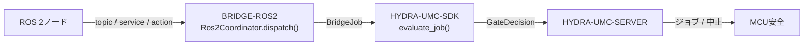

<!-- =============================================================================
HYDRA-UMC-BRIDGE-ROS2 - ROS 2双方向連携ブリッジ
Copyright (C) 2026 JuanenRac (Electro Hobby 3D) <electrohobby3d@gmail.com>
GPL-3.0-or-later - see LICENSE
============================================================================= -->

<p align="center">
  
</p>

# 🤖 HYDRA-UMC-BRIDGE-ROS2

<p align="center"><a href="README.md">🇺🇸 English</a> | <a href="README_spa.md">🇪🇸 Español</a> | <a href="README_fra.md">🇫🇷 Français</a> | <a href="README_ita.md">🇮🇹 Italiano</a> | <a href="README_deu.md">🇩🇪 Deutsch</a> | <a href="README_zho.md">🇨🇳 简体中文</a> | 🇯🇵 <b>日本語</b></p>

### 🔗 HYDRA-UMCとROS 2との間の依存関係なし連携境界

<p align="left">
  
  
  
</p>

---

## 1. 🛠️ 技術概要

**HYDRA-UMC-BRIDGE-ROS2** は、HYDRA-UMCとROS 2との間の双方向・高レベルの連携境界である。継続的な観測をtopicに、即時の検査をserviceに、長時間実行されるセル作業をキャンセル可能なactionにマッピングする。モーター制御ノードではなく、HYDRA-UMC-SERVER、MCUの限界、ウォッチドッグ、E-STOPを迂回することはできない。

本リポジトリは **External Automation Bridges** ファミリーに属する。CNC・LASER・OPENPNP・PRINTER3D・ROS2という兄弟リポジトリ群が、すべて `HYDRA-UMC-SDK` の同じ安全契約を共有しており、いずれのブリッジも独自の「作業に安全」という定義を勝手に作ることはできない。

### 主な機能:
* ✅ **実在する依存関係なしの連携コア:** `coordinator.py` の `Ros2Coordinator` には `rclpy` のインポートが一切ない —— 意図的に純粋なPythonであり、ROS 2のインストールなしにどのホストでもテスト可能である。*(実装済み、`tests/test_coordinator.py` でテスト済み)*
* ✅ **実在する3方向インターフェースマッピング:** 3つの固定クラス属性が、それぞれの目的に対して正確なROS 2インターフェース種別を予約する —— `/hydra_umc/machine_state`(topic、継続的な状態)、`/hydra_umc/inspect_cell`(service、短時間の検査)、`/hydra_umc/execute_cell_job`(action、キャンセル可能なジョブ)。*(実装済み)*
* ✅ **実在する共有安全ゲート:** `Ros2Coordinator.dispatch()` を通じて送信されるすべてのジョブは、`HYDRA-UMC-SDK` の `bridge_contract` にある `evaluate_job()` によって評価される。これは他のすべての兄弟ブリッジとHYDRA-UMC-SERVERが使うのと同じゲートである。実際のフェーズには外部機械が `IDLE` であり、HYDRA-UMCセルが `READY` であることが必要だが、`ABORT` は故障中でも要求可能である。*(実装済み)*
* ✅ **フェイルクローズのフェーズルーティングと静的エビデンス:** 生産フェーズは計画済みのジョブアクションにのみマッピングされ、`ABORT` は `/hydra_umc/request_safe_stop` にマッピングされる。未知の将来SDKフェーズは拒否される。`inspect_interface_plan.py` は、状態トピックが必要とする実際の `transient_local` durability QoS(ROS 1のlatchedパブリッシャーに代わるROS 2独自の仕組みで、design.ros2.org/articles/qos.html を参照して調査済み)を含む、静的スキーマ `1.1` のプランを、`rclpy` のインポートやDDSへの接続なしに出力する。*(実装・テスト済み)*
* ✅ **実在する部分的な `rclpy` トランスポート:** `rclpy_transport.py` は、今日すでに実際の標準ROS 2メッセージ型で2つのインターフェースを接続する —— `Ros2SafeStopClient`(実際の `std_srvs/Trigger` クライアント)と `Ros2StateSubscriber`(実際の `transient_local` durability QoSを使用する、実際の `std_msgs/String` サブスクライバー)。*(実装済み、`tests/test_rclpy_transport.py` でテスト済み)*
* ✅ **非破壊的なビルド/テスト:** `build-test.bat`/`.sh` はソースをコンパイルし、バージョンやCHANGELOGを変更せずに決定論的なユニットテストを実行する。*(実装済み、下記「ビルドと実行」を参照)*
* 🔜 **`inspect_service`/`job_action` 用のカスタム `.srv`/`.action` 契約** —— これらには実在する標準ROS 2メッセージ型が存在しないため、そのためのクライアントには、まずこのリポジトリが独自のインターフェースパッケージを定義する必要がある。*(計画中)*

---

## 2. 🔄 ROS 2連携フロー



---

## 3. 🧱 アーキテクチャと設計判断

* **なぜ `coordinator.py` は `rclpy` への依存が一切ないのか。** モジュール自身のドキュメント文字列がこれを意図的に明記している。「どのホストでもテスト可能であり、別途デプロイされたアダプターを通じてのみROS 2ノードになる」。これにより、安全に関わる連携ロジックはROS 2のインストールなしにCIでテスト可能となり、アダプターは後から独立して選定・検証できる。
* **なぜ汎用の1チャンネルではなく3つの異なるインターフェース種別を使うのか。** `state_topic`、`inspect_service`、`job_action` は意図的にROS 2自身のセマンティクスに対応している。継続的な状態発行にはリクエスト/レスポンスが不要(topic)、素早い検査には同期的な応答が必要(service)、セル作業は実行途中でキャンセル可能である必要がある(action)——これらを1つのチャンネルにまとめてしまうと、この区別が失われてしまう。
* **なぜ `Ros2Coordinator.dispatch()` はそれでも共有の `evaluate_job()` ゲートを通してすべてのジョブを流すのか。** ROS 2は、CNC、LASER、OPENPNP、PRINTER3Dが使うのと同じ `bridge_contract` の単なる別のクライアントに過ぎない —— 他のすべてのブリッジやHYDRA-UMC-SERVERが強制するIDLE/READYロジックを特別に迂回することはない。
* **なぜ故障中でも `ABORT` は要求可能なままなのか。** ゲートの実際のフェーズ要件(`IDLE` + `READY`)は、中止リクエストには意図的に同じ方法で適用されない —— オペレーターやROS 2ノードは、故障の最中であっても常に制御された停止を要求できなければならない。
* **なぜ `rclpy` アダプターとROS `.msg`/`.srv`/`.action` 契約がまだこのリポジトリにないのか。** 実際のROS 2環境が選定・テストされる前に特定のメッセージ/サービス/アクション定義に縛られることは、この依存関係のないローカルコアが検証できない前提を組み込むリスクを伴う。
* **エコシステムの他部分とどう関係するか。** BRIDGE-ROS2はROS 2ノードと `HYDRA-UMC-SDK` → `HYDRA-UMC-SERVER` → MCU安全との間に位置する。連携境界であり、モーター制御ノードでは決してなく、HYDRA-UMC-SERVER、MCUの限界、ウォッチドッグ、E-STOPを迂回することはできない。

---

## 📂 ディレクトリ構成

```text
HYDRA-UMC-BRIDGE-ROS2/
├── src/
│   └── hydra_umc_bridge_ros2/
│       ├── __init__.py
│       ├── coordinator.py       # Ros2Coordinator: 依存関係なしのtopic/service/actionゲート
│       ├── rclpy_transport.py   # 実rclpy転送 - 実際の標準ROS 2メッセージ型を持つ2つのインターフェースのみ
│       └── mqtt_transport.py    # このbridgeの既存の実ロジック向けの実MQTTブローカー転送
├── tests/
│   ├── test_coordinator.py      # 連携コアの決定論的ユニットテスト
│   ├── test_rclpy_transport.py  # 疑似ノード/パブリッシャーに対する実rclpy転送テスト
│   ├── test_mqtt_transport.py   # 疑似ブローカークライアントに対するMQTTコマンド/ステータス形状テスト
│   └── fixtures/
│       ├── interface-plan-v1.json    # schema-1.0 インターフェース互換性フィクスチャ
│       └── interface-plan-v1.1.json  # 公開 schema-1.1 インターフェース互換性フィクスチャ
├── tools/
│   ├── build_test.py            # 非破壊的なコンパイル+テストランナー (build-test.bat/.sh)
│   ├── inspect_interface_plan.py # 静的な plan-only スキーマ1.1インターフェースJSONを出力
│   ├── ci_validate.py           # 依存関係なし・非破壊のCIベースライン (.github/workflows/ci.yml が使用)
│   └── bump_version.py          # pyproject.toml、マニフェスト、CHANGELOG.md を同期
├── docs/
│   └── BRIDGE_GUIDE.md          # 適用範囲、対応プラットフォーム、スクリプト、ハードウェア受け入れゲート
├── images/
│   └── HYDRA_UMC_BANNER.svg     # README バナー
├── build-test.bat / build-test.sh  # 検証のみ、リポジトリを一切変更しない
├── build.bat / build.sh            # 検証後、成功時のみバージョン + CHANGELOG を更新
├── pyproject.toml               # パッケージメタデータ。HYDRA-UMC-SDK に依存 (git)
├── hydra-umc.project.json       # エコシステムマニフェスト(バージョン、成熟度、ファミリー)
├── CHANGELOG.md
├── CODE_OF_CONDUCT.md / CONTRIBUTING.md / SECURITY.md / SUPPORT.md
├── LICENSE / LICENSE.md
└── README.md / README_*.md      # 本ファイルおよびその6言語訳
```

---

## 4. ⚙️ ビルドと実行

Python 3.11以上が必要。`tools/build_test.py` は `HYDRA-UMC-SDK` が兄弟ディレクトリ(`../HYDRA-UMC-SDK`)としてチェックアウトされているか、環境変数 `HYDRA_UMC_SDK_ROOT` で指定されていることを期待する。

```bash
# Windows
build-test.bat      # 検証のみ —— バージョン/CHANGELOGの変更なし
build.bat            # 検証後、成功時にバージョン + CHANGELOG を更新

# Linux/macOS
bash build-test.sh
bash build.sh
```

`build-test` は `src/` 配下の各モジュールを `py_compile` でコンパイルし、`unittest` の全スイート(`tests/test_coordinator.py`)を実行する —— ROS 2のインストールもネットワークも不要で決定論的に動作し、バージョンやCHANGELOGを変更しない。`build` はまず同じ検証を実行し、成功した場合のみ `tools/bump_version.py` を呼び出して `pyproject.toml`、`hydra-umc.project.json`、`CHANGELOG.md` の間でバージョンを同期する。実際のハードウェア向け `run` コマンドはまだ存在しない —— それには検証済みのROS 2デプロイメントが必要である。

---

## ✅ 現状と次のステップ

**現時点で実在するもの:** バージョン `0.0.5`。連携コア、MQTTトランスポート、rclpyトランスポートを対象とする21件の決定論的な `unittest` スイート、フェイルクローズのフェーズルーティング、状態トピックが必要とする実際の `transient_local` durability QoS を宣言する静的な `plan-only` インターフェーススキーマ、実際の標準ROS 2メッセージ型を持つ2つのインターフェース向けの実際の(遅延インポートされる)`rclpy` トランスポート、SDKチェックアウトを伴いCIに組み込まれた非破壊的なbuild-testスクリプトを備える依存関係なしの連携コア(`Ros2Coordinator`)として機能している。

**統合境界:** このブリッジは連携境界に過ぎない —— モーター制御ノードではなく、HYDRA-UMC-SERVER、MCUの限界、ウォッチドッグ、E-STOPを迂回することはできない。送信されるすべてのジョブは、依然としてすべての兄弟ブリッジが使う同じ共有ゲートを通過する。

**今後の課題:** ROSネットワーク、ロボット、物理アクチュエーターはまだ一切検証されていない —— `rclpy` アダプターと具体的なROS `.msg`/`.srv`/`.action` 契約は、実際のROS 2環境が選定・テストされた後にのみ導入される。

---

## 🔗 関連プロジェクト

本プロジェクトは、同じ作者(JuanenRac / Electro Hobby 3D)による HYDRA-UMC ロボティクスエコシステムの一部です。リクエストが実はこの中のどれかについてのものである可能性があるため、知っておく価値があります。

**親プロジェクト**
- **[HYDRA-UMC-SERVER](https://github.com/JuanenRac/HYDRA-UMC-SERVER)** — すべての制御クライアントが実際に通信する、本物のヘッドレスバックエンド(REST/WebSocket)。各コマンドがこのブリッジ自身のローカル安全ゲートを通過した後、本ブリッジが報告する認証済みエコシステム境界。

**兄弟プロジェクト** —— それぞれ独自のクライアントとして、同じく HYDRA-UMC-SERVER 自身の API と通信する
- **[HYDRA-UMC-STUDIO](https://github.com/JuanenRac/HYDRA-UMC-STUDIO)** — リアルタイムのマルチロボット 3D 可視化を備えたウェブ制御ダッシュボード。
- **[HYDRA-UMC-SUITE](https://github.com/JuanenRac/HYDRA-UMC-SUITE)** — 複数のサーバーを同時に扱えるデスクトップ(PySide6)スウォームコマンドセンター、スタンドアロン実行ファイルとしてパッケージ化。
- **[HYDRA-UMC-ANDROID-CONTROL](https://github.com/JuanenRac/HYDRA-UMC-ANDROID-CONTROL)** — 生体認証ログインとペアリングされた Wear OS コンパニオンを備えたネイティブ Android 制御アプリ。
- **[HYDRA-UMC-IOS-CONTROL](https://github.com/JuanenRac/HYDRA-UMC-IOS-CONTROL)** — リアルタイム WebSocket 同期を備えた iOS/iPadOS 制御アプリ(Flutter)。
- **[HYDRA-UMC-DSI](https://github.com/JuanenRac/HYDRA-UMC-DSI)** — 本体搭載の 7 インチ DSI タッチスクリーン向けネイティブタッチ UI、CM5 自体に組み込み。
- **[HYDRA-UMC-BRIDGE-AMR](https://github.com/JuanenRac/HYDRA-UMC-BRIDGE-AMR)** — 実際の VDA 5050 MQTT パブリッシャーによる AGV/AMR フリートの調整境界。
- **[HYDRA-UMC-BRIDGE-CNC](https://github.com/JuanenRac/HYDRA-UMC-BRIDGE-CNC)** — 実際の GRBL ステータス/制御バイトへのアクセスを持つ、CNC セルの高レベルコーディネーター。
- **[HYDRA-UMC-BRIDGE-DROIDS](https://github.com/JuanenRac/HYDRA-UMC-BRIDGE-DROIDS)** — 実際の Boston Dynamics Spot コマンド送信機能を持つ、脚型/ヒューマノイドドロイドの調整境界。
- **[HYDRA-UMC-BRIDGE-LASER](https://github.com/JuanenRac/HYDRA-UMC-BRIDGE-LASER)** — 実際のキー/筐体/インターロック GPIO セーフガード 3 系統を読み取る、レーザーセルの安全コーディネーター。
- **[HYDRA-UMC-BRIDGE-OPENPNP](https://github.com/JuanenRac/HYDRA-UMC-BRIDGE-OPENPNP)** — OpenPnP ピックアンドプレースの基板フローを安全に統括する高レベルコーディネーター。
- **[HYDRA-UMC-BRIDGE-PRINTER3D](https://github.com/JuanenRac/HYDRA-UMC-BRIDGE-PRINTER3D)** — 実際にゲート制御されたジョブコマンドを持つ、Moonraker/Klipper 3D プリンター向けの安全な調整境界。
- **[HYDRA-UMC-BRIDGE-UAV](https://github.com/JuanenRac/HYDRA-UMC-BRIDGE-UAV)** — 実際の MAVLink コマンド送信機能を持つ、カメラ搭載 UAV の調整境界。

**直接関連**
- **[HYDRA-UMC-SDK](https://github.com/JuanenRac/HYDRA-UMC-SDK)** — すべてのブリッジが自身のコマンドを検証する共有 JSON-Schema 契約と安全ゲートの境界。
- **[HYDRA-UMC-MQTT-BROKER](https://github.com/JuanenRac/HYDRA-UMC-MQTT-BROKER)** — このブリッジ自身の `hydra/bridges/ros2/...` トピック向けの `mqtt_transport.py` の実際のトランスポート——プランのみのジョブゲート、実際の `std_srvs/Trigger` 安全停止呼び出し、そして別途デプロイされる `rclpy_transport.py` アダプターが常に想定していた形で再公開される実際の ROS 2 ステータストピック。詳細はそのリポジトリ自身の `docs/BRIDGE_TOPICS.md` を参照。
- **[HYDRA-UMC-HIL-BRIDGE](https://github.com/JuanenRac/HYDRA-UMC-HIL-BRIDGE)** — 実際の ROS 2 デプロイメント向けのハードウェア・イン・ザ・ループ実証経路。

**エコシステムの他のプロジェクト**

*コアハードウェア&プラットフォーム*
- **[HYDRA-UMC](https://github.com/JuanenRac/HYDRA-UMC)** — 実際のロボットアームのマザーボード——CM5 ホスト + デュアルコア STM32H745、CAN-OTA/SPI-OTA 経由で最大 8 本のツールアームを統括。
- **[HYDRA-UMC-OS](https://github.com/JuanenRac/HYDRA-UMC-OS)** — CM5 向けの再現可能な Raspberry Pi OS プロダクト層——読み取り専用エージェント、検証済み設定/プロファイル、WiFi 初回接続プロビジョニング。

*コアバックエンド&クライアント*
- **[HYDRA-UMC-EDITOR-URDF](https://github.com/JuanenRac/HYDRA-UMC-EDITOR-URDF)** — 完成したモデルを STUDIO 自身のカタログへ送信するデスクトップ用グラフィカル URDF 作成/編集ツール。

*URTC ツールプラットフォーム*
- **[URTC](https://github.com/JuanenRac/URTC)** — 物理的な Universal Robot Tool Controller 基板向けファームウェア、CAN バス経由の 25 以上のツールプロファイル。
- **[URTC-FLASHER](https://github.com/JuanenRac/URTC-FLASHER)** — URTC 基板用のデスクトップ GUI 書き込みツール、CAN-OTA およびフルチップ SWD/JTAG。
- **[URTC-TESTER](https://github.com/JuanenRac/URTC-TESTER)** — URTC 基板向けのデスクトップ CAN バスライブ診断ツール、ツールプロファイルごとに 1 パネル。
- **[URTC-WEB-STUDIO](https://github.com/JuanenRac/URTC-WEB-STUDIO)** — Web Serial API を使ったブラウザベースの URTC-TESTER の代替、ローカルインストール不要。

*ビジョン AI ノード(Hailo-8)*
- **[HYDRA-UMC-VISION-NODE](https://github.com/JuanenRac/HYDRA-UMC-VISION-NODE)** — Hailo-8 ビジョンパイプラインの統合ハブ、段階ごとの実際のハードウェア準備状況チェック付き。
- **[HYDRA-UMC-DETECTION-HEF](https://github.com/JuanenRac/HYDRA-UMC-DETECTION-HEF)** — Hailo アーキテクチャ/チェックサムによる安全読み込み検証を備えた、実際のコンパイル済みモデルレジストリ。
- **[HYDRA-UMC-VISION-STREAMER](https://github.com/JuanenRac/HYDRA-UMC-VISION-STREAMER)** — 実際の HailoRT 統合境界を持つ、実際の GStreamer パイプライン + MediaMTX 設定生成器。
- **[HYDRA-UMC-VISUAL-SERVOING-API](https://github.com/JuanenRac/HYDRA-UMC-VISUAL-SERVOING-API)** — 上流のゾーン状態に応じて安全ゲート制御される、実際の Position-Based Visual Servoing 補正則。
- **[HYDRA-UMC-SAFETY-ZONES](https://github.com/JuanenRac/HYDRA-UMC-SAFETY-ZONES)** — キャリブレーションの鮮度を強制する、実際のゾーン侵入チェックと E-STOP 要求。

*コグニティブ AI ノード(Hailo-10)*
- **[HYDRA-UMC-COGNITIVE-NODE](https://github.com/JuanenRac/HYDRA-UMC-COGNITIVE-NODE)** — Hailo-10 コグニティブパイプライン(LLM/VLA/音声オーケストレーション)の統合ハブ。
- **[HYDRA-UMC-VLA-ENGINE](https://github.com/JuanenRac/HYDRA-UMC-VLA-ENGINE)** — Vision-Language-Action モデル向けの、実際のアクショントークンのエンコード/デコードと軌道生成。
- **[HYDRA-UMC-VOICE-UI](https://github.com/JuanenRac/HYDRA-UMC-VOICE-UI)** — 確認ゲート付きの限定的な Watch リレーを備えた、実際の音声フロントエンド(VAD + 意図解析)。
- **[HYDRA-UMC-SEMANTIC-PLANNER](https://github.com/JuanenRac/HYDRA-UMC-SEMANTIC-PLANNER)** — MCU エラーコードに対する、実際のルールベースのタスク分解と意味的エラー復旧。
- **[HYDRA-UMC-DOCS-QA](https://github.com/JuanenRac/HYDRA-UMC-DOCS-QA)** — このエコシステム自身の Markdown ドキュメントに対する、標準ライブラリのみの実際の TF-IDF 文書検索。

*オーケストレーション&スウォーム*
- **[HYDRA-UMC-ORCHESTRATOR](https://github.com/JuanenRac/HYDRA-UMC-ORCHESTRATOR)** — 実際の gRPC/Protobuf ヘルスレポート契約とミッションステートマシンを持つ統合ハブ。
- **[HYDRA-UMC-JOB-DISPATCHER](https://github.com/JuanenRac/HYDRA-UMC-JOB-DISPATCHER)** — 実際の HTTP API 上に構築された、優先度ベースの実際のジョブキュー(重複排除付き)。
- **[HYDRA-UMC-NODE-HEALING](https://github.com/JuanenRac/HYDRA-UMC-NODE-HEALING)** — リトライ/バックオフとアイデンティティ不一致検出を備えた、実際の gRPC ベースのフリートヘルスウォッチドッグ。
- **[HYDRA-UMC-PATH-PLANNER-3D](https://github.com/JuanenRac/HYDRA-UMC-PATH-PLANNER-3D)** — 実際の障害物/ワークスペース衝突検証を備えた、実際の RRT ベースの 3D 経路プランナー。
- **[HYDRA-UMC-SWARM-SYNC](https://github.com/JuanenRac/HYDRA-UMC-SWARM-SYNC)** — 複数セルの収束についてプロパティテストされた、実際の CRDT LWW-Element-Map 状態同期。

*デジタルツイン&シミュレーション*
- **[HYDRA-UMC-TWIN](https://github.com/JuanenRac/HYDRA-UMC-TWIN)** — 実際のバージョン互換性同期契約を持つ、デジタルツインエンジンの統合ハブ。
- **[HYDRA-UMC-PHYSICS-REPLICA](https://github.com/JuanenRac/HYDRA-UMC-PHYSICS-REPLICA)** — 実際の URDF サブセットに対する、実際の順運動学と関節限界検証。
- **[HYDRA-UMC-SYNTHETIC-DATA-GEN](https://github.com/JuanenRac/HYDRA-UMC-SYNTHETIC-DATA-GEN)** — YOLO/COCO アノテーションのエクスポート機能を持つ、実際のプロシージャル 2D シーンジェネレーター。

*データ&分析*
- **[HYDRA-UMC-DATALAKE](https://github.com/JuanenRac/HYDRA-UMC-DATALAKE)** — 実際の取り込み/クエリ HTTP API を備えた、実際の sqlite3 ベースの時系列ストア。
- **[HYDRA-UMC-ANOMALY-DETECTOR](https://github.com/JuanenRac/HYDRA-UMC-ANOMALY-DETECTOR)** — ドリフト監視を備えた、実際の FFT + 統計ベースラインによる異常検知器。
- **[HYDRA-UMC-PRODUCTION-REPORTS](https://github.com/JuanenRac/HYDRA-UMC-PRODUCTION-REPORTS)** — DATALAKE の履歴に対する実際の OEE/稼働率計算、再現可能な CSV エクスポート付き。
- **[HYDRA-UMC-TELEMETRY-COLLECTOR](https://github.com/JuanenRac/HYDRA-UMC-TELEMETRY-COLLECTOR)** — シーケンス重複排除機能を備えた、DATALAKE への実際の CAN/WebSocket 取り込みパイプライン。

*産業用ゲートウェイ*
- **[HYDRA-UMC-GATEWAY-INDUSTRIAL](https://github.com/JuanenRac/HYDRA-UMC-GATEWAY-INDUSTRIAL)** — 実際のコマンド許可リスト/バックプレッシャー層を持つ、産業用プロトコルへ中継する統合ハブ。
- **[HYDRA-UMC-OPCUA-SERVER](https://github.com/JuanenRac/HYDRA-UMC-OPCUA-SERVER)** — 実際のバイナリプロトコルクライアントセッションで検証された、実際の OPC-UA アドレス空間。
- **[HYDRA-UMC-MTCONNECT-ADAPTER](https://github.com/JuanenRac/HYDRA-UMC-MTCONNECT-ADAPTER)** — 縮退モード出力を備えた、実際の MTConnect `/probe` および `/current` XML エンドポイント。

*補完ツール&エコシステム運用*
- **[HYDRA-UMC-DASHBOARD-AI](https://github.com/JuanenRac/HYDRA-UMC-DASHBOARD-AI)** — 誠実な統計フォールバックを備えた、DATALAKE/ANOMALY-DETECTOR 上のスマートサマリーと異常ハイライトパネル。
- **[HYDRA-UMC-TOOL-CLI](https://github.com/JuanenRac/HYDRA-UMC-TOOL-CLI)** — 実際の安定した終了コード契約を持つフリート CLI、HYDRA-UMC-SERVER 自身の API の本物のライブクライアント。
- **[HYDRA-UMC-WATCH](https://github.com/JuanenRac/HYDRA-UMC-WATCH)** — 実際の触覚アラートとペアリングされたスマートフォンへの音声リレーを備えた WearOS コンパニオンアプリ。
- **[URTC-SMART-RACK](https://github.com/JuanenRac/URTC-SMART-RACK)** — 実際の工具 ID デコードと Smart Idle 予熱ロジックを備えた、基板搭載ラック用ファームウェア。
- **[URTC-VISION-TOOL](https://github.com/JuanenRac/URTC-VISION-TOOL)** — サーマル/RGB 検査ツールヘッド向けの、ファームウェアと実際の Python ビジョンコンパニオン。
- **[HYDRA-UMC-UPDATER](https://github.com/JuanenRac/HYDRA-UMC-UPDATER)** — このエコシステム内のすべてのリポジトリを検出・クローン・更新する、管理用デスクトップツール。
- **[HYDRA-UMC-OS-REBUILDER](https://github.com/JuanenRac/HYDRA-UMC-OS-REBUILDER)** — エコシステムの最新バージョンをプリロードした、書き込み可能なCM5イメージを構築するWindows/Linuxデスクトップツール。Raspberry Pi Imager方式の初回起動Wi-Fi/ユーザー/SSH設定を備える。

---

## 📚 ドキュメント & コミュニティ

- **[CONTRIBUTING.md](CONTRIBUTING.md)** —— プルリクエストのための技術スタックとコーディング指針。
- **[CODE_OF_CONDUCT.md](CODE_OF_CONDUCT.md)** —— このコミュニティで期待される行動規範。
- **[SECURITY.md](SECURITY.md)** —— 脆弱性の報告方法と、このプロジェクトの実際のセキュリティ重点領域。
- **[SUPPORT.md](SUPPORT.md)** —— 質問の投稿先とバグの報告先。
- **[LICENSE.md](LICENSE.md)** —— このプロジェクト自身のライセンス。

## 👤 作者
**JuanenRac** (Electro Hobby 3D)
📧 electrohobby3d@gmail.com
📺 [youtube.com/@electrohobby3d](https://youtube.com/@electrohobby3d)

## 📜 ライセンス
GPL-3.0 - 詳細はLICENSEを参照。
