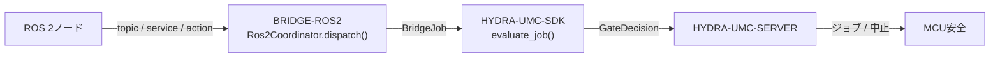

<!-- =============================================================================
HYDRA-UMC-BRIDGE-ROS2 - ROS 2双方向連携ブリッジ
Copyright (C) 2026 JuanenRac (Electro Hobby 3D) <electrohobby3d@gmail.com>
GPL-3.0-or-later - see LICENSE
============================================================================= -->

<p align="center">
  
</p>

# 🤖 HYDRA-UMC-BRIDGE-ROS2

<p align="center"><a href="README.md">🇺🇸 English</a> | <a href="README_spa.md">🇪🇸 Español</a> | <a href="README_fra.md">🇫🇷 Français</a> | <a href="README_ita.md">🇮🇹 Italiano</a> | <a href="README_deu.md">🇩🇪 Deutsch</a> | <a href="README_zho.md">🇨🇳 简体中文</a> | 🇯🇵 <b>日本語</b></p>

### 🔗 HYDRA-UMCとROS 2との間の依存関係なし連携境界

<p align="left">
  
  
  
</p>

---

## 1. 🛠️ 技術概要

**HYDRA-UMC-BRIDGE-ROS2** は、HYDRA-UMCとROS 2との間の双方向・高レベルの連携境界である。継続的な観測をtopicに、即時の検査をserviceに、長時間実行されるセル作業をキャンセル可能なactionにマッピングする。モーター制御ノードではなく、HYDRA-UMC-SERVER、MCUの限界、ウォッチドッグ、E-STOPを迂回することはできない。

本リポジトリは **External Automation Bridges** ファミリーに属する。CNC・LASER・OPENPNP・PRINTER3D・ROS2という兄弟リポジトリ群が、すべて `HYDRA-UMC-SDK` の同じ安全契約を共有しており、いずれのブリッジも独自の「作業に安全」という定義を勝手に作ることはできない。

### 主な機能:
* ✅ **実在する依存関係なしの連携コア:** `coordinator.py` の `Ros2Coordinator` には `rclpy` のインポートが一切ない —— 意図的に純粋なPythonであり、ROS 2のインストールなしにどのホストでもテスト可能である。*(実装済み、`tests/test_coordinator.py` でテスト済み)*
* ✅ **実在する3方向インターフェースマッピング:** 3つの固定クラス属性が、それぞれの目的に対して正確なROS 2インターフェース種別を予約する —— `/hydra_umc/machine_state`(topic、継続的な状態)、`/hydra_umc/inspect_cell`(service、短時間の検査)、`/hydra_umc/execute_cell_job`(action、キャンセル可能なジョブ)。*(実装済み)*
* ✅ **実在する共有安全ゲート:** `Ros2Coordinator.dispatch()` を通じて送信されるすべてのジョブは、`HYDRA-UMC-SDK` の `bridge_contract` にある `evaluate_job()` によって評価される。これは他のすべての兄弟ブリッジとHYDRA-UMC-SERVERが使うのと同じゲートである。実際のフェーズには外部機械が `IDLE` であり、HYDRA-UMCセルが `READY` であることが必要だが、`ABORT` は故障中でも要求可能である。*(実装済み)*
* ✅ **非破壊的なビルド/テスト:** `build-test.bat`/`.sh` はソースをコンパイルし、バージョンやCHANGELOGを変更せずに決定論的なユニットテストを実行する。*(実装済み、下記「ビルドと実行」を参照)*
* 🔜 **`rclpy` アダプターとROS `.msg`/`.srv`/`.action` 契約** —— 実際のROS 2環境が選定・テストされた後にのみ導入される。*(計画中)*

---

## 2. 🔄 ROS 2連携フロー



---

## 3. 🧱 アーキテクチャと設計判断

* **なぜ `coordinator.py` は `rclpy` への依存が一切ないのか。** モジュール自身のドキュメント文字列がこれを意図的に明記している。「どのホストでもテスト可能であり、別途デプロイされたアダプターを通じてのみROS 2ノードになる」。これにより、安全に関わる連携ロジックはROS 2のインストールなしにCIでテスト可能となり、アダプターは後から独立して選定・検証できる。
* **なぜ汎用の1チャンネルではなく3つの異なるインターフェース種別を使うのか。** `state_topic`、`inspect_service`、`job_action` は意図的にROS 2自身のセマンティクスに対応している。継続的な状態発行にはリクエスト/レスポンスが不要(topic)、素早い検査には同期的な応答が必要(service)、セル作業は実行途中でキャンセル可能である必要がある(action)——これらを1つのチャンネルにまとめてしまうと、この区別が失われてしまう。
* **なぜ `Ros2Coordinator.dispatch()` はそれでも共有の `evaluate_job()` ゲートを通してすべてのジョブを流すのか。** ROS 2は、CNC、LASER、OPENPNP、PRINTER3Dが使うのと同じ `bridge_contract` の単なる別のクライアントに過ぎない —— 他のすべてのブリッジやHYDRA-UMC-SERVERが強制するIDLE/READYロジックを特別に迂回することはない。
* **なぜ故障中でも `ABORT` は要求可能なままなのか。** ゲートの実際のフェーズ要件(`IDLE` + `READY`)は、中止リクエストには意図的に同じ方法で適用されない —— オペレーターやROS 2ノードは、故障の最中であっても常に制御された停止を要求できなければならない。
* **なぜ `rclpy` アダプターとROS `.msg`/`.srv`/`.action` 契約がまだこのリポジトリにないのか。** 実際のROS 2環境が選定・テストされる前に特定のメッセージ/サービス/アクション定義に縛られることは、この依存関係のないローカルコアが検証できない前提を組み込むリスクを伴う。
* **エコシステムの他部分とどう関係するか。** BRIDGE-ROS2はROS 2ノードと `HYDRA-UMC-SDK` → `HYDRA-UMC-SERVER` → MCU安全との間に位置する。連携境界であり、モーター制御ノードでは決してなく、HYDRA-UMC-SERVER、MCUの限界、ウォッチドッグ、E-STOPを迂回することはできない。

---

## 📂 ディレクトリ構成

```text
HYDRA-UMC-BRIDGE-ROS2/
├── src/
│   └── hydra_umc_bridge_ros2/
│       ├── __init__.py
│       └── coordinator.py       # Ros2Coordinator: 依存関係なしのtopic/service/actionゲート
├── tests/
│   └── test_coordinator.py      # 連携コアの決定論的ユニットテスト
├── tools/
│   ├── build_test.py            # 非破壊的なコンパイル+テストランナー (build-test.bat/.sh)
│   └── bump_version.py          # pyproject.toml、マニフェスト、CHANGELOG.md を同期
├── build-test.bat / build-test.sh  # 検証のみ、リポジトリを一切変更しない
├── build.bat / build.sh            # 検証後、成功時のみバージョン + CHANGELOG を更新
├── pyproject.toml               # パッケージメタデータ。HYDRA-UMC-SDK に依存 (git)
├── hydra-umc.project.json       # エコシステムマニフェスト(バージョン、成熟度、ファミリー)
├── CHANGELOG.md
├── CODE_OF_CONDUCT.md / CONTRIBUTING.md / SECURITY.md / SUPPORT.md
├── LICENSE / LICENSE.md
└── README.md / README_*.md      # 本ファイルおよびその6言語訳
```

---

## 4. ⚙️ ビルドと実行

Python 3.11以上が必要。`tools/build_test.py` は `HYDRA-UMC-SDK` が兄弟ディレクトリ(`../HYDRA-UMC-SDK`)としてチェックアウトされているか、環境変数 `HYDRA_UMC_SDK_ROOT` で指定されていることを期待する。

```bash
# Windows
build-test.bat      # 検証のみ —— バージョン/CHANGELOGの変更なし
build.bat            # 検証後、成功時にバージョン + CHANGELOG を更新

# Linux/macOS
bash build-test.sh
bash build.sh
```

`build-test` は `src/` 配下の各モジュールを `py_compile` でコンパイルし、`unittest` の全スイート(`tests/test_coordinator.py`)を実行する —— ROS 2のインストールもネットワークも不要で決定論的に動作し、バージョンやCHANGELOGを変更しない。`build` はまず同じ検証を実行し、成功した場合のみ `tools/bump_version.py` を呼び出して `pyproject.toml`、`hydra-umc.project.json`、`CHANGELOG.md` の間でバージョンを同期する。実際のハードウェア向け `run` コマンドはまだ存在しない —— それには検証済みのROS 2デプロイメントが必要である。

---

## ✅ 現状と次のステップ

**現時点で実在するもの:** バージョン `0.0.1`。ローカルの安全テストを備えた依存関係なしの連携コア(`Ros2Coordinator`)として機能しており、`HYDRA-UMC-SDK` の共有ジョブゲートの上に構築され、決定論的な `unittest` スイートと、SDKチェックアウトを伴いCIに組み込まれた非破壊的なbuild-testスクリプトを備える。

**統合境界:** このブリッジは連携境界に過ぎない —— モーター制御ノードではなく、HYDRA-UMC-SERVER、MCUの限界、ウォッチドッグ、E-STOPを迂回することはできない。送信されるすべてのジョブは、依然としてすべての兄弟ブリッジが使う同じ共有ゲートを通過する。

**今後の課題:** ROSネットワーク、ロボット、物理アクチュエーターはまだ一切検証されていない —— `rclpy` アダプターと具体的なROS `.msg`/`.srv`/`.action` 契約は、実際のROS 2環境が選定・テストされた後にのみ導入される。

---

## 🔗 関連プロジェクト

本プロジェクトは、同じ著者(JuanenRac / Electro Hobby 3D)によるより大きなロボティクス・エコシステムの一部であり、ファームウェア、制御ソフトウェア、AIノード、フリート管理ツールにまたがる。リクエストが実際には本リポジトリではなくこれらのいずれかに関するものである可能性があるため、知っておく価値がある。

### 直接関連

- **[HYDRA-UMC-SDK](https://github.com/JuanenRac/HYDRA-UMC-SDK)** —— このブリッジ(および他のすべてのブリッジ)がジョブを評価する共有のジョブ・安全契約。
- **[HYDRA-UMC-SERVER](https://github.com/JuanenRac/HYDRA-UMC-SERVER)** —— このブリッジが報告する認証済みエコシステム境界。
- **[HYDRA-UMC-HIL-BRIDGE](https://github.com/JuanenRac/HYDRA-UMC-HIL-BRIDGE)** —— 実際のROS 2デプロイメントに向けたハードウェア・イン・ザ・ループ実証パス。

### エコシステムのその他

**HYDRA-UMCプラットフォーム** —— このブリッジが補助機能を調整するマルチロボット・マイクロファクトリー
- **[HYDRA-UMC](https://github.com/JuanenRac/HYDRA-UMC)** —— 最大8本のロボットアームを統括するCM5 + STM32H745マザーボード。
- **[HYDRA-UMC-SERVER](https://github.com/JuanenRac/HYDRA-UMC-SERVER)** —— すべての制御クライアントとブリッジが通信するExpress/WebSocketバックエンド。
- **[HYDRA-UMC-STUDIO](https://github.com/JuanenRac/HYDRA-UMC-STUDIO)** —— Webベースの制御ダッシュボード、マルチロボット3D可視化。

**External Automation Bridges** —— 同じ `HYDRA-UMC-SDK` ジョブゲートを共有する兄弟リポジトリ群
- **[HYDRA-UMC-BRIDGE-CNC](https://github.com/JuanenRac/HYDRA-UMC-BRIDGE-CNC)** —— CNCセル連携ブリッジ。
- **[HYDRA-UMC-BRIDGE-LASER](https://github.com/JuanenRac/HYDRA-UMC-BRIDGE-LASER)** —— レーザーセル連携ブリッジ。
- **[HYDRA-UMC-BRIDGE-OPENPNP](https://github.com/JuanenRac/HYDRA-UMC-BRIDGE-OPENPNP)** —— OpenPnP向けボードフローブリッジ。
- **[HYDRA-UMC-BRIDGE-PRINTER3D](https://github.com/JuanenRac/HYDRA-UMC-BRIDGE-PRINTER3D)** —— オープンな3Dプリントソフトウェア向け連携ブリッジ。

**安全・統合の実証**
- **[HYDRA-UMC-SAFETY-ZONES](https://github.com/JuanenRac/HYDRA-UMC-SAFETY-ZONES)** —— ブリッジファミリー全体で使われるセルゾーンの安全実証。
- **[HYDRA-UMC-HIL-BRIDGE](https://github.com/JuanenRac/HYDRA-UMC-HIL-BRIDGE)** —— ハードウェア・イン・ザ・ループのテスト実証。

## 👤 著者
**JuanenRac** (Electro Hobby 3D)
📧 electrohobby3d@gmail.com

## 📜 ライセンス
GPL-3.0 - 詳細はLICENSEを参照。

## 🛠️ ビルドと実行

リリースビルド前に、バージョンを変更しないビルドチェックを使用する:

| 操作 | Windows | Linux / macOS |
|---|---|---|
| ビルドチェック(バージョンやCHANGELOGの変更なし) | `build-test.bat` | `./build-test.sh` |
| 実行 / 開発(提供されている場合) | `run*.bat` または `dev*.bat` | `./run*.sh` または `./dev*.sh` |

`build-test.bat` と `build-test.sh` は、`hydra-umc.project.json` を更新せず `CHANGELOG.md` も変更せずに、プロジェクトのスタックをコンパイルまたは検証する。生成するのは通常のコンパイラ出力のみである。既存の `build*.bat`、`build*.sh`、`run*`、`dev*` スクリプトは、それぞれプロジェクト固有・バージョン管理・実行時の挙動を保持する。その挙動が必要な場合はそれらを使用すること。
